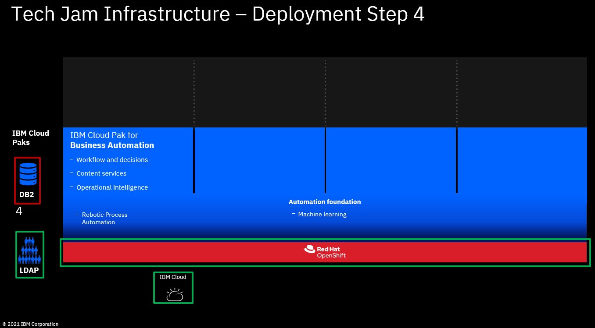
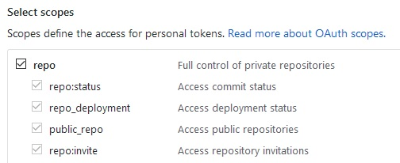

# Step 4: Deploy IBM DB2 Containers & create needed databases



1. Clone this git repository and copy the deployment files. As part of this doc, it is assumed that you clone into directory `/cp4ba`. If you select a different directory, you have to change the commands accordingly. It is also assumed that you use cluster name `mycluster`. If you select a different cluster name, you have to change the commands accordingly.

   ```bash
   mkdir /cp4ba
   cd /cp4ba
      
   git clone https://<your-personal-git-access-token>@github.com/IBM/cp4ba-rapid-deployment
   -or-
   git pull
   
   cd /cp4ba/cp4ba-rapid-deployment/cp4ba-21-0-1
   
   cp -r scripts mycluster
   
   cd mycluster/deployment-db2-cp4ba
   ```

   **Note:** If you don't have a personal git access token follow these steps to create one:

   - Create an access token, on this page: **https://github.com/settings/tokens/new**
   - Configure the access token so that it can access the repositories. You can use these settings:
     
   - Store the access token in a safe place, if you forget it, you'll need to revoke it and create a new one
   - Git can be managed through the git CLI, you need some one time configuration first:

     ```bash
     git config --global user.email <your-email>
     
     git config --global user.name <your-email>
     ```

   - You now can run the git clone command from above to clone the repository

   **Note:** Instead of cloning this git repository, you also can download it as zip file (on the main page click the green button), after download, extract the archive

2. Dependant on the CP4BA template selected in **[Step 0: Select the CP4BA template for deployment](00selectTemplate.md)**, get a DB2 Standard Edition license key to enable containerized DB2 to use more CPUs and RAM compared to the Community Edition

   **Note:** In case you don't have access to a DB2 Standard Edition license key, you can install DB2 with the Community Edition license that is included by default. But, this might result in issues when deploying some of the provided CP4BA templates later on, as it might happen that the CPE Object Stores can't be automatically initialized while the deployment as the DB connections might not be able to be created. In that case, scale down the operator to zero after the Object Store initialization failed and create the missing DB connections manually. Then, scale up the operator to one and it will successfully initialize the Object Stores.

   - On PPA or XL SW, search for part number CC36WML and download DB2_DSE_Activation_11.5.zip
   - Extract db2std_vpc.lic from the archive (can be found in DB2_DSE_Activation_11.5.zip/std_vpc/db2/license)
   - Base64 encode your Db2 license by running the following commands:

     ```bash
     LICENSE_KEY="./db2std_vpc.lic"
     
     cat ${LICENSE_KEY} | base64 | tr -d '\n'
     ```

   - Save the encoded output, as you will add it to your properties file in the next step

   **Note:** More background on this topic can be found here: **https://www.ibm.com/support/producthub/db2/docs/content/SSEPGG_11.5.0/com.ibm.db2.luw.qb.server.doc/doc/c0061199.html**

3. In folder **deployment-db2-cp4ba** update the properties file for DB2 **01-parametersForDb2OnOCP.sh**, provide the following properties:

   - `cp4baTemplateToUse` - Name of CP4BA deployment template that will be used e.g. `ibm_cp4a_cr_template.100.ent.ClientOnboardingDemo.yaml`
   - `db2OnOcpProjectName` - Namespace where DB2 should be installed e.g. `ibm-db2`
   - `db2AdminUserPassword` - Password that will be assigned to the db2 instance user e.g. `passw0rd`
   - `db2StandardLicenseKey` - provide the encoded licence key from previous step
   - `db2Cpu` - Number of CPUs for DB2 pod according to the selected CP4BA template
   - `db2Memory` - Amount of memory for DB2 pod according to the selected CP4BA template

   Also review the other properties, in case changes are needed, e.g., if you are not deploying on ROKS, specify `cp4baDeploymentPlatform=OCP` and also provide the `db2OnOcpStorageClassName` available on your own OpenShift cluster (must be RWX). For ROKS a `db2StorageSize` of `500Gi` is optimal as the size also defines the IOPS. If you are not deploying on ROKS and your storage provider gives you good IO speed with smaller storage size, you can reduce that value to `150Gi`.

4. Login to your OCP cluster through OC CLI, for example:
   
   ```
   oc login --token=<your-token> --server=https://<your-server>:<your-port>
   ```
   
   **Note:** You can copy the login command from the OCP Web console.

5. Run script **02-createDb2OnOCP.sh**.  This script will install and configure DB2 for you.  If the script displays the following banner **all** DB2 components have been deployed and configured properly.

   ```bash
   *********************************************************************************
   ********* Installation and configuration of DB2 completed successfully! *********
   *********************************************************************************
   ```

   After this banner is displayed it is possible for the script to fail on some post deployment clean up work.  Failing the cleanup work does not impact the successful deployment and configuration of DB2.

   **Notes:**
   - To successfully run the script you need the **jq tool** and **podman** installed - if not yet installed, install them before running the script
   - You need your **Entitlement Registry key** handy, see also **[Step 1: Create your IBM Cloud Account (or use existing)](01createIBMCloudAccount.md)**
   - This script will exit if errors are hit during the installation.
   - This script is idempotent.

6. Take a note of the hostname (or IP address) provided in the previous step as well as the port number for the DB2 installation and enter values in **01-parametersForDb2OnOCP.sh**.  The properties to modify are as follow:

   - `db2HostName` -  Hostname or IP to access DB2 instance as provided by output of **02-createDb2OnOCP.sh** script
   - `db2PortNumber` - Port number to access DB2 instance as provided by output of **02-createDb2OnOCP.sh** script

   **Notes:**
   - If needed, you can run the **97-retrieveDB2HostDetails.sh** to display the DB2 host information once again.

7. Run script **03-createCp4baDBs4Db2OnOCP.sh** to create the databases needed for the CP4BA template that you selected

   **Note:** In case you got errors **creating** DBs, please use script **99-dropCp4baDBs4Db2OnOCP.sh** to drop all DBs - then re-run script **03-createCp4baDBs4Db2OnOCP.sh**

   **Note:** In case you got errors **activating** DBs, please use script **04-activateDBs.sh** to try to activate them again - if your DB2 pod got enough memory assigned (e.g., `110Gi` for the Client Onboarding template) and you are using a DB2 Standard Edition license, activation of all DBs should be successful

   **Note:** In case you are not using the DB2 Standard Edition license or have assigned less memory to DB2 than specified for the selected CP4BA template, it might happen that not all databases got activated which might lead to other issues later while the deployment of CP4BA

8. Review the output of the script and make sure there were no errors, all databases got created and activated

## What to do next

Now, that all the prerequisites for IBM Cloud Pak for Business Automation are there, you can run **[Step 5: Install IBM Cloud Pak for Business Automation Operator  &  deploy IBM Cloud Pak for Business Automation (Enterprise)](05installCP4BA.md)**

**[Here](Readme.md)** you can get back to the overview page

Issues or questions? IBMers can use this IBM internal Slack channel: **#dba-swat-asset-qna** (**https://ibm-cloud.slack.com/archives/C026TD1SGCA**)

Everyone else can open a new issue in this github.
