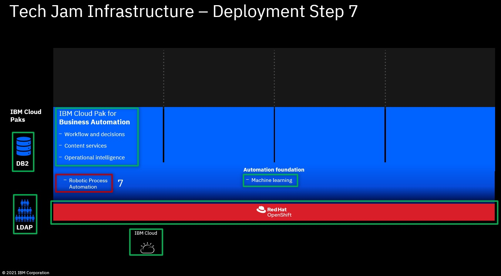

# Step 7: Optional: Create new VM for RPA & install IBM RPA

1. Follow **[Create new VM for LDAP  &  install IBM SDS  &  import ldif file with users and groups](03createVMForLDAP.md)** to request a new VM. Please note the following differences:
   
   - OS: should use Windows Server 2012 or Windows Server 2016
   - Private Security Group and Public Security Group: do NOT select anything, or the password of administrative user will not be created
   
   After the VM is created, you can add "allow_all" to both security groups

2. Follow **[IBM RPA SaaS client installation document](https://www.ibm.com/docs/en/rpa/20.12?topic=installation-saas-client)** to install RPA SaaS client

## What to do next

Optionally, you can complete **[Step 8: Optional: Scale up the deployment](08scaleUp.md)**

**[Here](Readme.md)** you can get back to the overview page

Issues or questions? IBMers can use this IBM internal Slack channel: **#dba-swat-asset-qna** (**https://ibm-cloud.slack.com/archives/C026TD1SGCA**)

Everyone else can open a new issue in this github.
