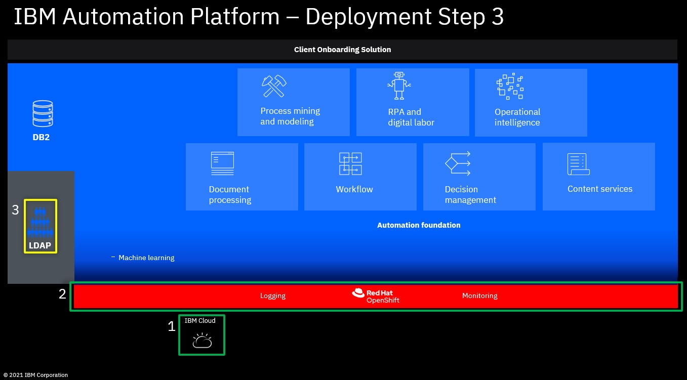
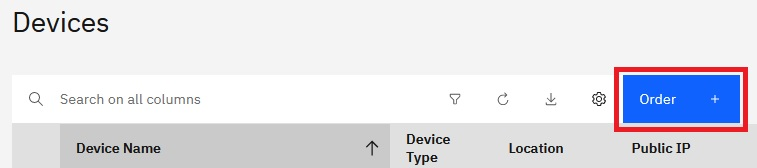
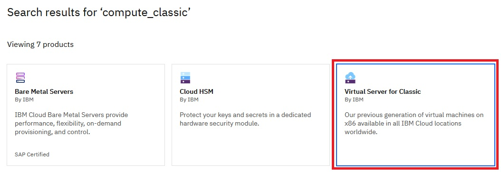
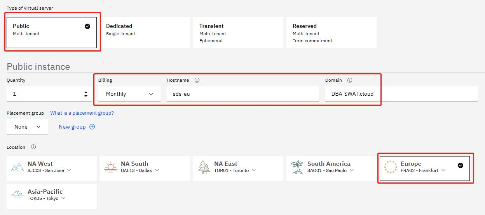
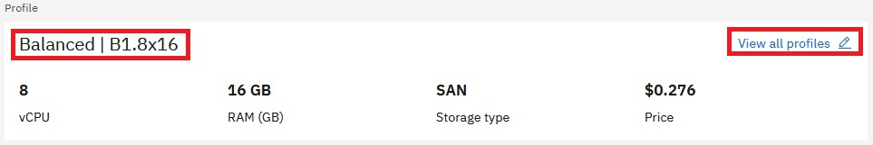
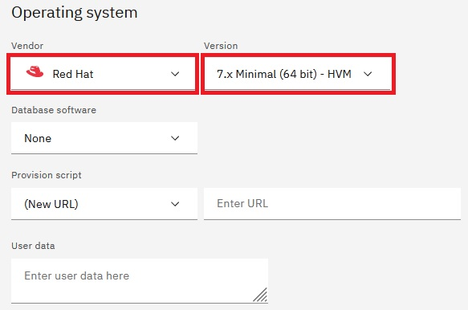
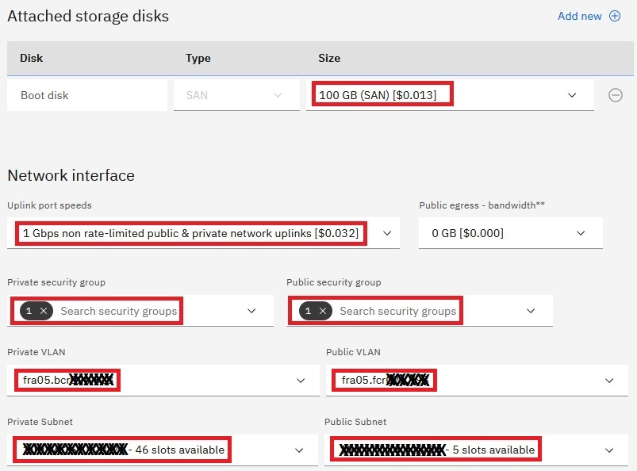
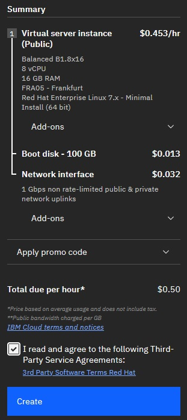
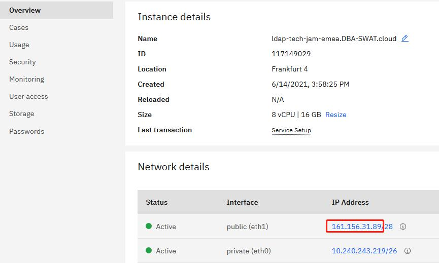
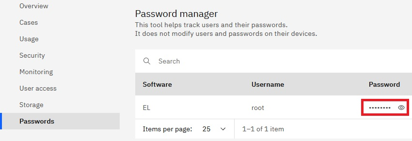

# Step 3: Create new VM for LDAP & install IBM SDS & import ldif file with users and groups



## Create new VM for LDAP

Please also refer to **https://cloud.ibm.com/docs/virtual-servers?topic=virtual-servers-ordering-vs-public**

1. Log-in to **https://cloud.ibm.com/login**

2. Select the account under which to create the new ROKS cluster

3. Click Classic Infrastructure.

   

4. Click Order.

   

5. Click Virtual Server for Classic.

   

6. Select the configurations.

   - Type of virtual server: **Public**
   - Public instance: 
    - Quantity: 1
    - Billing: Hourly
    - Hostname: use any name
    - Domain: use default

   Please note the hostname plus domain name should be less than 64 characters.
   
   - Location: select the same datacenter with OCP cluster.

     

   - Profile: Click "View all profiles" and select one. For SDS we use B1.8x16 (8C 16G SAN)

     

   - Image: CentOS is cheaper. Red Hat (RHEL) and Windows need additional cost. For SDS we use Red Hat 7.x Minimal. Please do not use Red Hat 8 as vncserver is not easily configured on v8.

     

   - Storage: select 100GB.
   - Network interface: select 1Gbps under Public and Private.
   - Private security group: check "allow_all".
   - Public security group: check "allow_all".
   - Private VLAN: select the same VLAN with the ROKS cluster.

     

   Then the page will calculate the price for you. Click Create to order the VSI.

     

   After a while you can see it in device list: **https://cloud.ibm.com/gen1/infrastructure/devices**. Once it's started, click the VSI, under **Overview** tab you can find the IP address. 

   

   Navigate to **Passwords**. You can find the login credentials there.

   

## Download required files to the VM

The SSH service is started by default for the VM, listens on port 22. Connect to it using any SSH software.

Download SDS 6.4 installation image (sds64-linux-x86-64.iso, part number: CN487ML) and upload it to the **/root/install** folder of the VM. You can use linux scp command, WinSCP, FileZilla or any software suppports SFTP protocol. 

SCP command sample:
```
scp sds64-linux-x86-64.iso root@<ip>:/root/install
```

## Install SDS using command line

1. Prerequisites

Some packages required by SDS 6.4 (and DB2 10.5) are not installed by default on the VM. You need install them first. The pre-configured yum repository doesn't work, you need download the RPM packages and copy them to the VM. 

- ksh: https://centos.pkgs.org/7/centos-x86_64/ksh-20120801-142.el7.x86_64.rpm.html
- libaio.so.1: https://centos.pkgs.org/7/centos-x86_64/libaio-0.3.109-13.el7.x86_64.rpm.html

Then install the RPM packages.
```
rpm -ivh ksh-20120801-142.el7.x86_64.rpm
rpm -ivh libaio-0.3.109-13.el7.x86_64.rpm 
```

2. Mount the SDS installation image

```
mkdir /media/sds
mount -o loop /root/install/sds64-linux-x86-64.iso /media/sds
```

3. Install IBM Installation Manager

```
/media/sds/ibm_im_64bit/installc -log /root/install/im_install_log.txt -acceptLicense -installationDirectory /opt/IBM/InstallationManager -showProgress
```

Sample output:
```
Installed com.ibm.cic.agent_1.8.0.20140902_1503 to the /opt/IBM/InstallationManager/eclipse directory.
```

4. Install GSKit

```
rpm -ivh /media/sds/ibm_gskit/gskcrypt64-8.0.50.34.linux.x86_64.rpm
rpm -ivh /media/sds/ibm_gskit/gskssl64-8.0.50.34.linux.x86_64.rpm
```

5. Create silent installation response file

Copy the response file to /root/install folder and make it writable.

```
cp /media/sds/SilentInstallScripts/sds_silent_install_response.xml /root/install
chmod +w /root/install/sds_silent_install_response.xml
```

Replace the installation directory to `/media/sds`.
```
sed -i "s|<install_image>|/media/sds|g" /root/install/sds_silent_install_response.xml
```

Remove db2 installation path so that DB2 will be installed together.
```
sed -i "s|<DB2_Installation_Path>||g" /root/install/sds_silent_install_response.xml
```

Change the option for `user.use.existing.gskit` to `true` to use existing GSKit:
```
sed -i "s|<data key='user.use.existing.gskit,com.ibm.security.directoryserver.v64' value='false'/>|<data key='user.use.existing.gskit,com.ibm.security.directoryserver.v64' value='true'/>|g" /root/install/sds_silent_install_response.xml
```

Remove the value for `user.gskit.executable.path` so that IM will not install GSKit.
```
sed -i "s|<data key='user.gskit.executable.path,com.ibm.security.directoryserver.v64' value='/media/sds/ibm_gskit'/>|<data key='user.gskit.executable.path,com.ibm.security.directoryserver.v64' value=''/>|g" /root/install/sds_silent_install_response.xml
```

5. Install SDS

```
/opt/IBM/InstallationManager/eclipse/tools/imcl input /root/install/sds_silent_install_response.xml -acceptLicense -showProgress
```

Sample output:
```
Installed com.ibm.security.directoryserver.v64_6.4.0.20150225_0826 to the /opt/ibm/ldap/V6.4 directory.
Installed com.ibm.security.directoryserver.entitlement.v64_6.4.0.20150225_0827 to the /opt/ibm/ldap/V6.4 directory.
```

## Create LDIF file to define users and groups

In our scenario we have the following users and groups:
- cp4badmin: the administrator for everything in CP4BA
- cp4badmins: the administrative group, contains only cp4badmin user.
- usr001-usr200: common users for CP4BA
- cp4bausers: the group of common users, contains usr001-usr200 and cp4badmin.

We have two LDIF files:
- cp4ba.ldif: defines usr001-usr200.
- predefined.ldif: defines user cp4badmin and groups cp4badmins/cp4bausers.

As the passwords for usr001-usr200 will change everytime we create a new ROKS cluster, we created a script `generateLDIF.sh` to generate the LDIF file `cp4ba.ldif`. You can also use this script to create new set of users.
```
generateLDIF.sh
```

It will require **pwgen** utility to generate random passwords. Please install it first. For RHEL 7 you can download the RPM package from https://centos.pkgs.org/7/epel-x86_64/pwgen-2.08-1.el7.x86_64.rpm.html.

The script will generate three files:
- cp4ba.ldif: this is the LDIF file we need to import to LDAP server
- password.txt: this is all the passwords for later use (e.g. save it to a CSV file for RPA chatbot)
- githubpwd.txt: this file contains all passwords in special format to update document on github (ldapinformation.md) for our internal use. You can just ignore it.

## SDS Configuration using command line

During the configuration the scripts will ask for your confirmation, like this:
```
Do you want to....
 (1) Continue with the above actions, or
 (2) Exit without making any changes:
```

Please answer 1 to continue.

1. Create LDAP server instance:

```
/opt/ibm/ldap/V6.4/sbin/idsicrt -I ldap1 -p 389 -s 636 -e mysecretkey! -G idsldap -w passw0rd
```

Parameters:
- -I: server instance name: ldap1. This is also the ldap instance database user.
- -p: non-secure port: 389
- -s: secure port: 636
- -e: encryption seed. Here we use `mysecretkey!`.
- -G: ldap instance database user group
- -w: ldap instance database user password

Sample output:
```
GLPWRP123I The program '/opt/ibm/ldap/V6.4/sbin/64/idsadduser' is used with the following arguments '-u ldap1 -g idsldap -w *****'.


You have chosen to perform the following actions:

GLPGRP019I System user will be created for directory server instance.
GLPGRP020I The system user 'ldap1' will be created.
GLPGRP021I The user's primary group 'idsldap' will be created.
GLPGRP024I The user 'ldap1' will be a member of group 'idsldap'.
GLPGRP025I The user 'root' will be a member of group 'idsldap'.
GLPGRP005I The password for user 'ldap1' will be set.
Do you want to....
 (1) Continue with the above actions, or
 (2) Exit without making any changes:1

GLPGRP023I The default home directory for user 'ldap1' will be /home/ldap1.
GLPGRP034I The group 'idsldap' already exists.
GLPGRP029I The user 'ldap1' was created successfully.
GLPGRP030I The user 'ldap1' was added to group 'idsldap' successfully.
GLPGRP047I The user 'root' is already a member of group 'idsldap'.
GLPGRP006I Setting the password for user 'ldap1'
GLPGRP007I Successfully changed password for user 'ldap1'.
GLPWRP123I The program '/opt/ibm/ldap/V6.4/sbin/64/idsicrt' is used with the following arguments 'idsicrt -I ldap1 -p 389 -s 636 -e ***** -G idsldap -w *****'.
You have chosen to perform the following actions:

GLPICR020I A new directory server instance 'ldap1' will be created.
GLPICR057I The directory server instance will be created at: '/home/ldap1'.
GLPICR013I The directory server instance's port will be set to '389'.
GLPICR014I The directory server instance's secure port will be set to '636'.
GLPICR015I The directory instance's administration server port will be set to '3538'.
GLPICR016I The directory instance's administration server secure port will be set to '3539'.
GLPICR019I The description will be set to: 'IBM Security Directory Server Instance V6.4'.
GLPICR021I Database instance 'ldap1' will be configured.

Do you want to....
 (1) Continue with the above actions, or
 (2) Exit without making any changes:1

GLPICR028I Creating directory server instance: 'ldap1'.
GLPICR025I Registering directory server instance: 'ldap1'.
GLPICR026I Registered directory server instance: : 'ldap1'.
GLPICR049I Creating directories for directory server instance: 'ldap1'.
GLPICR050I Created directories for directory server instance: 'ldap1'.
GLPICR043I Creating key stash files for directory server instance: 'ldap1'.
GLPICR044I Created key stash files for directory server instance: 'ldap1'.
GLPICR040I Creating configuration file for directory server instance: 'ldap1'.
GLPICR041I Created configuration file for directory server instance: 'ldap1'.
GLPICR034I Creating schema files for directory server instance: 'ldap1'.
GLPICR035I Created schema files for directory server instance: 'ldap1'.
GLPICR037I Creating log files for directory server instance: 'ldap1'.
GLPICR038I Created log files for directory server instance: 'ldap1'.
GLPICR088I Configuring log files for directory server instance: 'ldap1'.
GLPICR089I Configured log files for directory server instance: 'ldap1'.
GLPICR085I Configuring schema files for directory server instance: 'ldap1'.
GLPICR086I Configured schema files for directory server instance: 'ldap1'.
GLPICR073I Configuring ports and IP addresses for directory server instance: 'ldap1'.
GLPICR074I Configured ports and IP addresses for directory server instance: 'ldap1'.
GLPICR077I Configuring key stash files for directory server instance: 'ldap1'.
GLPICR078I Configured key stash files for directory server instance: 'ldap1'.
GLPICR046I Creating profile scripts for directory server instance: 'ldap1'.
GLPICR047I Created profile scripts for directory server instance: 'ldap1'.
GLPICR103I Adding instance information to the .profile file for directory server instance: 'ldap1'.
GLPICR104I Added instance information to the .profile file for directory server instance: 'ldap1'.
GLPICR069I Adding entry to /etc/inittab for the administration server for directory instance: 'ldap1'.
GLPICR070I Added entry to /etc/inittab for the administration server for directory instance: 'ldap1'.
GLPICR118I Creating runtime executable for directory server instance: 'ldap1'.
GLPICR119I Created runtime executable for directory server instance: 'ldap1'.
GLPCTL074I Starting admin server for directory server instance: 'ldap1'.
GLPCTL075I Started admin server for directory server instance: 'ldap1'.
GLPICR029I Created directory server instance: : 'ldap1'.
GLPICR031I Adding database instance 'ldap1' to directory server instance: 'ldap1'.
GLPCTL002I Creating database instance: 'ldap1'.
GLPCTL003I Created database instance: 'ldap1'.
GLPICR133I Setting the DB2 registry for database instance 'ldap1' to allow DB2 SELECTIVITY.
GLPICR134I The DB2 registry for database instance 'ldap1' has been set to allow DB2 SELECTIVITY.
GLPCTL017I Cataloging database instance node: 'ldap1'.
GLPCTL018I Cataloged database instance node: 'ldap1'.
GLPCTL008I Starting database manager for database instance: 'ldap1'.
GLPCTL009I Started database manager for database instance: 'ldap1'.
GLPCTL049I Adding TCP/IP services to database instance: 'ldap1'.
GLPCTL050I Added TCP/IP services to database instance: 'ldap1'.
GLPICR081I Configuring database instance 'ldap1' for directory server instance: 'ldap1'.
GLPICR082I Configured database instance 'ldap1' for directory server instance: 'ldap1'.
GLPICR052I Creating DB2 instance link for directory server instance: 'ldap1'.
GLPICR053I Created DB2 instance link for directory server instance: 'ldap1'.
GLPICR032I Added database instance 'ldap1' to directory server instance: 'ldap1'.
```

2. Create administrator DN and password.

```
/opt/ibm/ldap/V6.4/sbin/idsdnpw -I ldap1 -u cn=root -p passw0rd
```

Sample output:
```
You have chosen to perform the following actions:

GLPDPW004I The directory server administrator DN will be set.
GLPDPW005I The directory server administrator password will be set.

Do you want to....
 (1) Continue with the above actions, or
 (2) Exit without making any changes:1

GLPDPW009I Setting the directory server administrator DN.
GLPDPW010I Directory server administrator DN was set.
GLPDPW006I Setting the directory server administrator password.
GLPDPW007I Directory server administrator password was set.
```

3. Create database instance for LDAP instance:

```
/opt/ibm/ldap/V6.4/sbin/idscfgdb -I ldap1 -a ldap1 -t ldap1 -l /home/ldap1 -w passw0rd
```
Parameters:
- -I: ldap instance name
- -a: database administrator user
- -t: database name
- -I: database directory
- -w: database administrator password

Sample output:
```
GLPWRP123I The program '/opt/ibm/ldap/V6.4/sbin/64/idscfgdb' is used with the following arguments '-I ldap1 -a ldap1 -t ldap1 -l /home/ldap1'.
You have chosen to perform the following actions:

GLPCDB023I Database 'ldap1' will be configured.
GLPCDB024I Database 'ldap1' will be created at '/home/ldap1'

Do you want to....
 (1) Continue with the above actions, or
 (2) Exit without making any changes:1

GLPCDB035I Adding database 'ldap1' to directory server instance: 'ldap1'.
GLPCTL017I Cataloging database instance node: 'ldap1'.
GLPCTL018I Cataloged database instance node: 'ldap1'.
GLPCTL008I Starting database manager for database instance: 'ldap1'.
GLPCTL009I Started database manager for database instance: 'ldap1'.
GLPCTL026I Creating database: 'ldap1'.
GLPCTL027I Created database: 'ldap1'.
GLPCTL034I Updating the database: 'ldap1'
GLPCTL035I Updated the database: 'ldap1'
GLPCTL020I Updating the database manager: 'ldap1'.
GLPCTL021I Updated the database manager: 'ldap1'.
GLPCTL023I Enabling multi-page file allocation: 'ldap1'
GLPCTL024I Enabled multi-page file allocation: 'ldap1'
GLPCDB005I Configuring database 'ldap1' for directory server instance: 'ldap1'.
GLPCDB006I Configured database 'ldap1' for directory server instance: 'ldap1'.
GLPCTL037I Adding local loopback to database: 'ldap1'.
GLPCTL038I Added local loopback to database: 'ldap1'.
GLPCTL011I Stopping database manager for the database instance: 'ldap1'.
GLPCTL012I Stopped database manager for the database instance: 'ldap1'.
GLPCTL008I Starting database manager for database instance: 'ldap1'.
GLPCTL009I Started database manager for database instance: 'ldap1'.
GLPCDB003I Added database 'ldap1' to directory server instance: 'ldap1'.
```

4. Add suffix `dc=example,dc=com`.

```
/opt/ibm/ldap/V6.4/sbin/idscfgsuf -I ldap1 -s "dc=example,dc=com"
```

Sample output:

```
GLPWRP123I The program '/opt/ibm/ldap/V6.4/sbin/64/idscfgsuf' is used with the following arguments '-I ldap1 -s dc=example,dc=com'.
You have chosen to perform the following actions:

GLPCSF007I Suffix 'dc=example,dc=com' will be added to the configuration file of the directory server instance 'ldap1'.

Do you want to....
 (1) Continue with the above actions, or
 (2) Exit without making any changes:1


GLPCSF004I Adding suffix: 'dc=example,dc=com'.
GLPCSF005I Added suffix: 'dc=example,dc=com'.
```

5. Import LDIF.
Upload the LDIF files to /root/install folder.

```
/opt/ibm/ldap/V6.4/sbin/ldif2db -i /root/install/cp4ba.ldif -I ldap1
/opt/ibm/ldap/V6.4/sbin/ldif2db -i /root/install/predefined.ldif -I ldap1
```


Sample output:
```
GLPCTL113I Largest core file size creation limit for the process (in bytes): '0'(Soft limit) and '-1'(Hard limit).
GLPCTL119I Maximum Data Segment(Kbytes) soft ulimit for the process is -1 and the prescribed minimum is 262144.
GLPCTL119I Maximum File Size(512 bytes block) soft ulimit for the process is -1 and the prescribed minimum is 2097152.
GLPCTL122I Maximum Open Files soft ulimit for the process is 1024 and the prescribed minimum is 500.
GLPCTL121I Maximum Stack Size(Kbytes) soft ulimit for the process was 8192 and it is modified to the prescribed minimum 10240.
GLPCTL119I Maximum Virtual Memory(Kbytes) soft ulimit for the process is -1 and the prescribed minimum is 1048576.
GLPCOM022I The database plugin is successfully loaded from libback-config.so.
GLPSRV221I Replication of security attributes feature is disabled.
GLPSRV200I Initializing primary database and its connections.
GLPRPL137I Restricted Access to the replication topology is set to false.
GLPRDB002W ldif2db: 17 entries have been successfully added out of 17 attempted.
```

6. Start LDAP server
```
/opt/ibm/ldap/V6.4/sbin/idsslapd -I ldap1
```

Sample output:
```
GLPSRV041I Server starting.
GLPSRV235I Premium feature activation code is loaded and initialized.
GLPCTL113I Largest core file size creation limit for the process (in bytes): '0'(Soft limit) and '-1'(Hard limit).
GLPCTL119I Maximum Data Segment(Kbytes) soft ulimit for the process is -1 and the prescribed minimum is 262144.
GLPCTL119I Maximum File Size(512 bytes block) soft ulimit for the process is -1 and the prescribed minimum is 2097152.
GLPCTL122I Maximum Open Files soft ulimit for the process is 1024 and the prescribed minimum is 500.
GLPCTL121I Maximum Stack Size(Kbytes) soft ulimit for the process was 8192 and it is modified to the prescribed minimum 10240.
GLPCTL119I Maximum Virtual Memory(Kbytes) soft ulimit for the process is -1 and the prescribed minimum is 1048576.
GLPCOM024I The extended Operation plugin is successfully loaded from libevent.so.
GLPCOM024I The extended Operation plugin is successfully loaded from libtranext.so.
GLPCOM024I The extended Operation plugin is successfully loaded from libldaprepl.so.
GLPSRV155I The DIGEST-MD5 SASL Bind mechanism is enabled in the configuration file.
GLPCOM021I The preoperation plugin is successfully loaded from libDigest.so.
GLPCOM024I The extended Operation plugin is successfully loaded from libevent.so.
GLPCOM024I The extended Operation plugin is successfully loaded from libtranext.so.
GLPCOM023I The postoperation plugin is successfully loaded from libpsearch.so.
GLPCOM024I The extended Operation plugin is successfully loaded from libpsearch.so.
GLPCOM025I The audit plugin is successfully loaded from libldapaudit.so.
GLPCOM024I The extended Operation plugin is successfully loaded from libevent.so.
GLPCOM023I The postoperation plugin is successfully loaded from libpsearch.so.
GLPCOM024I The extended Operation plugin is successfully loaded from libpsearch.so.
GLPCOM022I The database plugin is successfully loaded from libback-config.so.
GLPCOM024I The extended Operation plugin is successfully loaded from libevent.so.
GLPCOM024I The extended Operation plugin is successfully loaded from libtranext.so.
GLPCOM023I The postoperation plugin is successfully loaded from libpsearch.so.
GLPCOM024I The extended Operation plugin is successfully loaded from libpsearch.so.
GLPCOM022I The database plugin is successfully loaded from libback-rdbm.so.
GLPCOM010I Replication plugin is successfully loaded from libldaprepl.so.
GLPSRV189I Virtual list view support is enabled.
GLPCOM021I The preoperation plugin is successfully loaded from libpta.so.
GLPSRV194I The Record Deleted Entries feature is disabled. Deleted entries are immediately removed from the database.
GLPSRV207I Group conflict resolution during replication is disabled.
GLPSRV221I Replication of security attributes feature is disabled.
GLPSRV200I Initializing primary database and its connections.
GLPRDB126I The directory server will not use DB2 selectivity.
GLPCOM024I The extended Operation plugin is successfully loaded from libloga.so.
GLPCOM024I The extended Operation plugin is successfully loaded from libidsfget.so.
GLPSRV232I Pass-through authentication is disabled.
GLPSRV234I Pass-through support for compare operations is disabled.
GLPCOM003I Non-SSL port initialized to 389.
```

## What to do next

You can now proceed with **[Step 4: Deploy IBM DB2 Containers  &  create needed databases](04deployIBMDB2.md)**

**[Here](Readme.md)** you can get back to the overview page

Issues or questions? IBMers can use this IBM internal Slack channel: **#dba-swat-asset-qna** (**https://ibm-cloud.slack.com/archives/C026TD1SGCA**)

Everyone else can open a new issue in this github.
