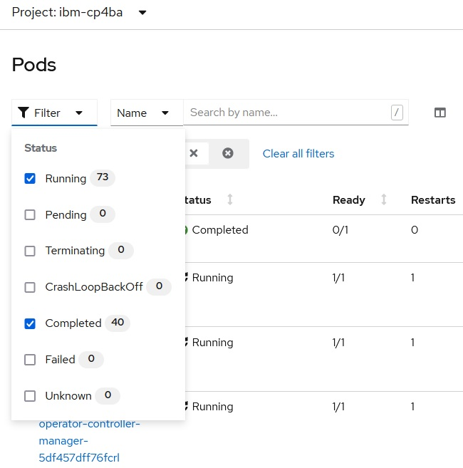
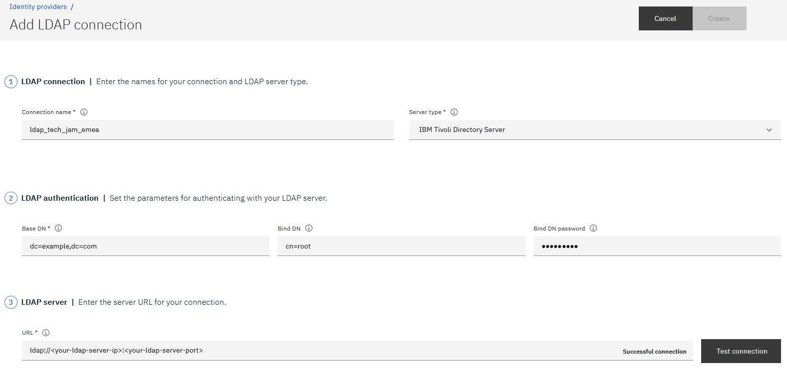
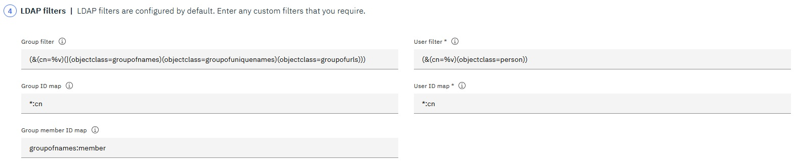
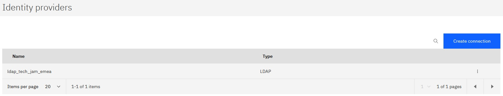

# Step 5: Install IBM Cloud Pak for Business Automation Operator & deploy IBM Cloud Pak for Business Automation (Enterprise)


1. Onto your bastion host, download the Case package: **https://github.com/IBM/cloud-pak/raw/master/repo/case/ibm-cp-automation-3.1.0.tgz** into a temporary directory, e.g., `/temp`, and extract `ibm-cp-automation-3.1.0.tar` into the same temporary directory, e.g., `/temp`

2. Extract the content of `ibm-cp-automation-3.1.0.tar` into the same temporary directory, e.g., `/temp`

3. Extract the content of archive `/temp/ibm-cp-automation/inventory/cp4aOperatorSdk/files/deploy/crs/cert-k8s-21.0.2.tar` into directory `/cp4ba`

4. If you are deploying on a ROKS cluster, copy the modified storage class definitions so that CP4BA Operator is using them (in this version of the storage classes the reclaimPolicy got changed to Delete and the name got adapted, because Delete is usually the better reclaimPolicy for ROKS and Demo environments)
   
   ```
   cp /cp4ba/cp4ba-rapid-deployment/cp4ba-21-0-2/<your-cluster-name>/deployment-db2-cp4ba/cp4a-*-storage-class.yaml /cp4ba/cert-kubernetes/descriptors/
   ```
   
   For example:
   
   ```
   cp /cp4ba/cp4ba-rapid-deployment/cp4ba-21-0-2/mycluster/deployment-db2-cp4ba/cp4a-*-storage-class.yaml /cp4ba/cert-kubernetes/descriptors/
   cp: overwrite ‘cp4ba/cert-kubernetes/descriptors/cp4a-bronze-storage-class.yaml’? y
   cp: overwrite ‘cp4ba/cert-kubernetes/descriptors/cp4a-gold-storage-class.yaml’? y
   cp: overwrite ‘cp4ba/cert-kubernetes/descriptors/cp4a-silver-storage-class.yaml’? y
   ```

5. From cert-kubernetes, execute script **cp4a-clusteradmin-setup.sh**
   
   Sample script output
   
   ```
   cd /cp4ba/cert-kubernetes/scripts/
   
   ./cp4a-clusteradmin-setup.sh
   
   
   Select the cloud platform to deploy:
   1) RedHat OpenShift Kubernetes Service (ROKS) - Public Cloud
   2) Openshift Container Platform (OCP) - Private Cloud
   3) Other ( Certified Kubernetes Cloud Platform / CNCF)
   Enter a valid option [1 to 3]: 1
   
   
   This script prepares the OLM for the deployment of some Cloud Pak for Business Automation capabilities 
   
   What type of deployment is being performed?
   1) Demo
   2) Enterprise
   Enter a valid option [1 to 2]: 2
   
   Enter the name for a new project or an existing project (namespace): <your-ibm-cp4ba-project>
   Using project <your-ibm-cp4ba-project>...
   
   
   Follow the instructions on how to get your Entitlement Key: 
   https://www.ibm.com/support/knowledgecenter/en/SSYHZ8_21.0.x/com.ibm.dba.install/op_topics/tsk_images_enterp_entitled.html
   
   Do you have a Cloud Pak for Business Automation Entitlement Registry key (Yes/No, default: No): y
   
   Enter your Entitlement Registry key: 
   Verifying the Entitlement Registry key...
   Login Succeeded!
   Entitlement Registry key is valid.
   
   To provision the persistent volumes and volume claims
   please enter the dynamic storage classname for fast storage: cp4a-file-delete-gold-gid
   Creating docker-registry secret for Entitlement Registry key in project <your-ibm-cp4ba-project>...
   secret/admin.registrykey created
   Done
   
   Applying the persistent volumes for the Cloud Pak operator by using the storage classname: cp4a-file-delete-gold-gid...
   
   persistentvolumeclaim/operator-shared-pvc created
   persistentvolumeclaim/cp4a-shared-log-pvc created
   Done
   
   Waiting for the persistent volumes to be ready...
   ......
   ......
   ......
   ......
   ......
   ......
   ......
   ......
   ......
   ......
   ......
   Done
   ibm-operator-catalog   IBM Operator Catalog   grpc   IBM         26h
   Found existing ibm operator catalog source, updating it
   catalogsource.operators.coreos.com/ibm-operator-catalog unchanged
   catalogsource.operators.coreos.com/opencloud-operators created
   IBM Operator Catalog source updated!
   Waiting for CP4A Operator Catalog pod initialization
   CP4BA Operator Catalog is running ibm-operator-catalog-kq2rn                                        1/1   Running             0     16h
   operatorgroup.operators.coreos.com/ibm-cp4a-operator-catalog-group created
   CP4BA Operator Group Created!
   subscription.operators.coreos.com/ibm-cp4a-operator-catalog-subscription created
   CP4BA Operator Subscription Created!
   Waiting for CP4BA operator pod initialization
   No resources found in ibm-cp4ba namespace.
   Waiting for CP4BA operator pod initialization
   No resources found in ibm-cp4ba namespace.
   Waiting for CP4BA operator pod initialization
   No resources found in ibm-cp4ba namespace.
   Waiting for CP4BA operator pod initialization
   No resources found in ibm-cp4ba namespace.
   Waiting for CP4BA operator pod initialization
   No resources found in ibm-cp4ba namespace.
   Waiting for CP4BA operator pod initialization
   No resources found in ibm-cp4ba namespace.
   Waiting for CP4BA operator pod initialization
   Waiting for CP4BA operator pod initialization
   Waiting for CP4BA operator pod initialization
   Waiting for CP4BA operator pod initialization
   Waiting for CP4BA operator pod initialization
   Waiting for CP4BA operator pod initialization
   Waiting for CP4BA operator pod initialization
   CP4A operator is running ibm-cp4a-operator-69dd7c66bb-2ndbx                                1/1   Running             0     97s
   Copying the JDBC driver for the operator...
   Done
   
   Label the default namespace to allow network policies to open traffic to the ingress controller using a namespaceSelector...namespace/default labeled
   Done
   
   Create storage classes for deployment: Done 
   
   Below is the route host name for the environment, which is required as an input during the execution of the deployment script for the creation of routes in OCP. You can also get the host name by running the following command: oc get route console -n openshift-console -o yaml|grep routerCanonicalHostname. Take note of the host name. 
   <your-hostname>
   ```

6. Wait untill all Operators are installed, this might take a while (you need to see e.g. 7 pods in \<your-ibm-cp4ba-project\>, 12 pods in ibm-common-services project, all Running and Ready 1/1)
   
   **Note:** The number of pods can vary based on when you install and what version of the Operators is installed.

7. In folder **deployment-db2-cp4ba** update the properties file for CP4BA **05-parametersForCp4ba.sh**, provide the following properties:

   - `cp4baProjectName`, e.g., `ibm-cp4ba` - make sure to use the same value as used before when running script cp4a-clusteradmin-setup.sh
   - `cp4baOcpHostname` - see output of command `oc get route console -n openshift-console -o yaml|grep routerCanonicalHostname`
   - `cp4baTlsSecretName` - see also secret name in project ibm-cert-store on ROKS, if you are not deploying on ROKS leave empty
   - `cp4baAdminPassword`, e.g., `passw0rd` - use the password for user cp4badmin in the generated .ldif file when setting up LDAP
   - `cp4baUmsAdminPassword`, e.g., `passw0rd` - here you can specify any password
   - `ldapAdminPassword`, e.g., `passw0rd` - use the password that you specified for cn=root when setting up LDAP
   - `ldapServer`, e.g., `123.456.679.012` - the hostname or IP of the previously installed LDAP server
   
   **Note:** Also review the other properties, in case changes are needed, e.g., in case you are not deploying on ROKS, also provide correct Storage Class values for properties `cp4baScSlow`, `cp4baScMedium` and `cp4baScFast`. These Storage Classes have to provide RWX storage, for more details about storage for CP4BA, see also **https://www.ibm.com/docs/en/cloud-paks/cp-biz-automation/21.0.x?topic=pei-storage-considerations**.

8. Run script **07-createCp4baDeployment.sh**
   
   Sample script output
   
   ```
   cd /cp4ba/cp4ba-rapid-deployment/cp4ba-21-0-2/mycluster/deployment-db2-cp4ba
   
   ./07-createCp4baDeployment.sh
   
   Found 01-parametersForDb2OnOCP.sh.  Reading in variables from that script.
     Reading 01-parametersForDb2OnOCP.sh ...
   Done!
   
   Found 05-parametersForCp4ba.sh.  Reading in variables from that script.
     Reading 05-parametersForCp4ba.sh ...
   Done!
   
   This script PREPARES and optionaly CREATES the CP4BA deployment using template <your-template> in project <your-ibm-cp4ba-project>. 
   
   Are 01-parametersForDb2OnOCP.sh and 05-parametersForCp4ba.sh up to date, and do you want to continue? (Yes/No, default: No): y
   
   Preparing the CP4BA deployment...
   
   Switching to project <your-ibm-cp4ba-project>...
   Already on project "<your-ibm-cp4ba-project>" on server "https://<hostname>:<port>".
   
   Collecting information for secret ibm-entitlement-key. For this, your Entitlement Registry key is needed.
   
   Enter your Entitlement Registry key: 
   Verifying the Entitlement Registry key...
   Login Succeeded!
   Entitlement Registry key is valid.
   
   Copying jdbc for Db2 from Db2 container to local disk...
   Now using project "<your-ibm-db2-project>" on server "https://<hostname>:<port>".
   tar: Removing leading `/' from member names
   tar: Removing leading `/' from member names
   Now using project "<your-ibm-cp4ba-project>" on server "https://<hostname>:<port>".
   
   Preparing the CP4BA secrets...
   
   Preparing the tls secret...
   Now using project "ibm-cert-store" on server "https://<hostname>:<port>".
   Now using project "<your-ibm-cp4ba-project>" on server "https://<hostname>:<port>".
   
   Preparing the CR YAML for deployment...
   
   All artefacts for deployment are prepared.
   
   Do you want to CREATE the CP4BA deployment in project <your-ibm-cp4ba-project> now? (Yes/No, default: No): y
   
   Creating the CP4BA deployment...
   
   Creating secret ibm-entitlement-key...
   secret/ibm-entitlement-key created
   Done.
   
   Copying the jdbc driver to ibm-cp4a-operator...
   Done.
   
   Creating CP4BA secrets...
   secret/ldap-bind-secret created
   secret/icp4a-shared-encryption-key created
   secret/resource-registry-admin-secret created
   secret/ibm-dba-ums-secret created
   secret/ibm-ban-secret created
   secret/ibm-fncm-secret created
   secret/icp4adeploy-bas-admin-secret created
   secret/playback-server-admin-secret created
   secret/icp4adeploy-workspace-aae-app-engine-admin-secret created
   secret/aca-basedb created
   secret/ibm-adp-secret created
   secret/ibm-bawaut-server-db-secret created
   secret/ibm-pfs-admin-secret created
   secret/ibm-bawaut-admin-secret created
   Done.
   
   Creating the tls secret...
   secret/icp4a-tls-secret created
   Done.
   
   Creating the CP4BA deployment...
   icp4acluster.icp4a.ibm.com/icp4adeploy created
   Done.
   
   All changes got applied. Exiting...
   ```

9. The deployment of CP4BA might now take several hours dependant on the CP4BA template that you selected. Monitor the logs of the Operator to spot any potential issues.
   
   **Note:** In case you have not used a DB2 Standard Edition license key or enough memory for the DB2, closely monitor the operator logs. This configuration might result in issues when deploying CP4BA, as it might happen that the CPE Object Stores can't be automatically initialized while the deployment as the DB connections might not be able to be created. In that case, scale down the operator to zero after the Object Store initialization failed and create the missing DB connections manually. Then, scale up the operator to one and it will usually initialze the Object Stores.

10. The CP4BA deployment of the Client Onboarding template is complete when you see about 69 Running and Ready pods, and 41 Completed pods, but no Pending / CrashLoopBackOff pods in your project. It might be that some pods are in Failed state, for those make sure there is another instance of that pod in Completed state. If this is the case, you can delete the Failed pods.
    
    **Note:** It might be that going forward the number of pods mentioned here (69 Running and Ready, 41 Completed) does change, as with every new installation latest versions of ibm-common-services and IBM Automation Foundation are installed and those latest versions might come with a different number of Running and / or Completed pods. The most important point here is that you don't see pods in any other state.
    
    **Note:** If you selected another CP4BA template, the number of pods also will be different.
    
    
    
    ```
    oc get pods
    NAME                                                              READY   STATUS      RESTARTS   AGE
    create-secrets-job-g9zkm                                          0/1     Completed   0          18h
    iaf-ai-operator-controller-manager-6c9c6f4c69-7mssz               1/1     Running     1          19h
    iaf-core-operator-controller-manager-57f9744658-mp77s             1/1     Running     1          19h
    iaf-eventprocessing-operator-controller-manager-5df457dff76fcrl   1/1     Running     1          19m
    iaf-flink-operator-controller-manager-84fdff7f5b-5q4jx            1/1     Running     0          19h
    iaf-operator-controller-manager-d7996db65-bnl75                   1/1     Running     1          19h
    iaf-system-apicurio-657cc4658-r627z                               1/1     Running     0          17h
    iaf-system-elasticsearch-es-data-0                                2/2     Running     0          18m
    iaf-system-elasticsearch-es-data-1                                2/2     Running     1          18h
    iaf-system-elasticsearch-es-data-2                                2/2     Running     0          18h
    iaf-system-entity-operator-848f9744c5-p97lf                       3/3     Running     0          17h
    iaf-system-kafka-0                                                1/1     Running     0          17h
    iaf-system-kafka-1                                                1/1     Running     0          17h
    iaf-system-kafka-2                                                1/1     Running     0          17h
    iaf-system-zookeeper-0                                            1/1     Running     0          17h
    iaf-system-zookeeper-1                                            1/1     Running     0          17h
    iaf-system-zookeeper-2                                            1/1     Running     0          17h
    iam-config-job-4vjk4                                              0/1     Completed   0          18h
    ibm-common-service-operator-64f7b5bc45-nfwxd                      1/1     Running     0          19m
    ibm-cp4a-operator-69dd7c66bb-2ndbx                                1/1     Running     0          19h
    ibm-elastic-operator-controller-manager-7f9fd4569-j8llb           1/1     Running     1          19h
    ibm-nginx-5f55689857-jw8sf                                        1/1     Running     0          18h
    ibm-nginx-5f55689857-mnl6k                                        1/1     Running     0          18h
    icp4adeploy-ads-credentials-service-79d545-2hp2d                  1/1     Running     0          13h
    icp4adeploy-ads-download-service-56695dc859-5wmzn                 1/1     Running     0          13h
    icp4adeploy-ads-embedded-build-service-797d9bdb74-p2d49           1/1     Running     0          13h
    icp4adeploy-ads-embedded-runtime-service-57b4bcd79-ng6z4          1/1     Running     0          13h
    icp4adeploy-ads-front-6c588d6d-sk2pb                              1/1     Running     0          13h
    icp4adeploy-ads-git-service-6676fd7d55-s78hl                      1/1     Running     0          13h
    icp4adeploy-ads-ltpa-creation-wmbkv                               0/1     Completed   0          13h
    icp4adeploy-ads-mongo-7b77c6ccb4-5gk6f                            1/1     Running     1          13h
    icp4adeploy-ads-parsing-service-7685bc864d-ccwrv                  1/1     Running     0          13h
    icp4adeploy-ads-rest-api-5587ccf58c-7qw2r                         1/1     Running     0          13h
    icp4adeploy-ads-rr-registration-1623825900-hh78d                  0/1     Completed   0          33m
    icp4adeploy-ads-rr-registration-1623826800-nzm5w                  0/1     Completed   0          18m
    icp4adeploy-ads-rr-registration-1623827700-9shng                  0/1     Completed   0          3m57s
    icp4adeploy-ads-rr-registration-initjob-2bsgk                     0/1     Completed   0          13h
    icp4adeploy-ads-run-service-7795f79bb9-68x94                      1/1     Running     0          13h
    icp4adeploy-ads-runtime-bai-registration-1a4f674750b190185d7cz7   0/1     Completed   0          16m
    icp4adeploy-ads-runtime-service-799968fdc8-skfrr                  1/1     Running     0          20m
    icp4adeploy-ads-runtime-ums-registration-f5724ddf1621f1001z257s   0/1     Completed   0          13h
    icp4adeploy-ads-ums-registration-23a921542a01ab8454c5543c3xswt7   0/1     Completed   0          13h
    icp4adeploy-bai-admin-69f7ccdf8c-h92mn                            1/1     Running     0          12h
    icp4adeploy-bai-bpmn-rqc7s                                        0/1     Completed   0          12h
    icp4adeploy-bai-business-performance-center-8456d695c8-qqctb      1/1     Running     0          12h
    icp4adeploy-bai-content-ctv2r                                     0/1     Completed   0          12h
    icp4adeploy-bai-even-7a58-eve-29ee-ep-jobmanager-0                2/2     Running     0          15h
    icp4adeploy-bai-even-7a58-eve-29ee-ep-taskmanager-0               1/1     Running     0          24m
    icp4adeploy-bai-even-7a58-eve-29ee-ep-taskmanager-1               1/1     Running     0          15h
    icp4adeploy-bai-even-7a58-eve-29ee-ep-taskmanager-2               1/1     Running     0          15h
    icp4adeploy-bai-even-7a58-eve-29ee-ep-taskmanager-3               1/1     Running     0          15h
    icp4adeploy-bai-event-forwarder-vtnhj                             0/1     Completed   0          12h
    icp4adeploy-bai-icm-g5brg                                         0/1     Completed   0          12h
    icp4adeploy-bai-management-6b85dd77f-xjnvm                        1/1     Running     0          47m
    icp4adeploy-bai-setup-q77j9                                       0/1     Completed   0          12h
    icp4adeploy-ban-job-7llvw                                         0/1     Completed   0          15h
    icp4adeploy-bastudio-authoring-jms-0                              1/1     Running     0          16h
    icp4adeploy-bastudio-bootstrap-pjph5                              0/1     Completed   0          17h
    icp4adeploy-bastudio-deployment-5678bc4756-lm9ph                  1/1     Running     0          16h
    icp4adeploy-bastudio-ltpa-z42gx                                   0/1     Completed   0          17h
    icp4adeploy-bastudio-oidc-wt4pt                                   0/1     Completed   0          17h
    icp4adeploy-bastudio-zen-translation-xbhtw                        0/1     Completed   0          17h
    icp4adeploy-cmis-deploy-68cf6696fd-dxx75                          1/1     Running     0          16h
    icp4adeploy-cpe-deploy-75fcc9dc4-79wsw                            1/1     Running     0          16h
    icp4adeploy-css-deploy-1-768d64bdcf-rd6db                         1/1     Running     0          16h
    icp4adeploy-dba-rr-11d7c36190                                     1/1     Running     0          17h
    icp4adeploy-dba-rr-3c59840b29                                     1/1     Running     0          17h
    icp4adeploy-dba-rr-7047ad6dd3                                     1/1     Running     0          17h
    icp4adeploy-elasticsearch-statefulset-0                           2/2     Running     0          14h
    icp4adeploy-graphql-deploy-586ffcbfc7-g5hkx                       1/1     Running     0          16h
    icp4adeploy-mls-itp-7f69c8b58b-dvksk                              1/1     Running     0          14h
    icp4adeploy-mls-wfi-db64cdfd6-rkkvp                               1/1     Running     0          14h
    icp4adeploy-navigator-deploy-6d7fd7d6c5-t8nvs                     1/1     Running     0          15h
    icp4adeploy-pbk-ae-db-job-wbt2z                                   0/1     Completed   0          17h
    icp4adeploy-pbk-ae-deployment-59b7fcbc7c-szlt2                    1/1     Running     0          17h
    icp4adeploy-pbk-ae-oidc-job-hmdsl                                 0/1     Completed   0          17h
    icp4adeploy-pfs-0                                                 1/1     Running     0          14h
    icp4adeploy-pfs-dbareg-f8b6b8df4-kglx7                            1/1     Running     0          14h
    icp4adeploy-pfs-umsregistry-job-ddlh6                             0/1     Completed   0          14h
    icp4adeploy-rr-backup-1623827700-qfpfv                            0/1     Completed   0          3m57s
    icp4adeploy-rr-setup-pod                                          0/1     Completed   0          17h
    icp4adeploy-ums-scim-deployment-588cc59dd5-mcfvl                  1/1     Running     0          17h
    icp4adeploy-ums-sso-deployment-7488b49b4c-sfvht                   1/1     Running     0          17h
    icp4adeploy-ums-teams-deployment-599f8c9548-zm8p2                 1/1     Running     0          17h
    icp4adeploy-workflow-authoring-baw-basimport-job-7lhzg            0/1     Completed   0          13h
    icp4adeploy-workflow-authoring-baw-case-init-job-lj6z7            0/1     Completed   0          14h
    icp4adeploy-workflow-authoring-baw-content-init-job-plv7r         0/1     Completed   0          14h
    icp4adeploy-workflow-authoring-baw-db-init-job-8ljl8              0/1     Completed   0          14h
    icp4adeploy-workflow-authoring-baw-db-init-job-pfs-phlz7          0/1     Completed   0          14h
    icp4adeploy-workflow-authoring-baw-jms-0                          1/1     Running     0          14h
    icp4adeploy-workflow-authoring-baw-ltpa-5587n                     0/1     Completed   0          14h
    icp4adeploy-workflow-authoring-baw-oidc-registry-job-6hlgd        0/1     Completed   0          14h
    icp4adeploy-workflow-authoring-baw-server-0                       1/1     Running     0          22m
    icp4adeploy-workflow-authoring-baw-workplace-job-4mstl            0/1     Completed   0          14h
    icp4adeploy-workspace-aae-ae-db-job-vcwws                         0/1     Completed   0          14h
    icp4adeploy-workspace-aae-ae-deployment-ff87f985b-p6v2m           1/1     Running     0          14h
    icp4adeploy-workspace-aae-ae-oidc-job-7j6hf                       0/1     Completed   0          14h
    setup-nginx-job-sbqqd                                             0/1     Completed   0          18h
    usermgmt-7487c49bbb-cs8sm                                         1/1     Running     0          18h
    usermgmt-7487c49bbb-n9l2s                                         1/1     Running     0          18h
    zen-audit-788557799d-dth8s                                        1/1     Running     0          18h
    zen-core-5b46c84f45-cczjv                                         1/1     Running     0          18h
    zen-core-5b46c84f45-nhggh                                         1/1     Running     0          18h
    zen-core-api-5df865c8bc-tzwnk                                     1/1     Running     0          18h
    zen-core-api-5df865c8bc-xp69g                                     1/1     Running     0          18h
    zen-metastoredb-0                                                 1/1     Running     0          18h
    zen-metastoredb-1                                                 1/1     Running     0          18h
    zen-metastoredb-2                                                 1/1     Running     0          18h
    zen-metastoredb-certs-xnp7f                                       0/1     Completed   0          18h
    zen-metastoredb-init-ljxsb                                        0/1     Completed   0          18h
    zen-post-requisite-job-688pz                                      0/1     Completed   0          18h
    zen-pre-requisite-job-5mmz6                                       0/1     Completed   0          18h
    zen-watcher-5b7c78bd6f-pgmbl                                      1/1     Running     0          18h
    ```

11. Now that the deployment is complete, you need to apply some post-deployment steps. First post-deployment step is to enable you to log in with the users from LDAP. For this, first get the user ID and password of the zen admin user by running those two commands:
    
    ```
    oc -n ibm-common-services get secret platform-auth-idp-credentials -o jsonpath='{.data.admin_username}' | base64 -d && echo
    ```
    ```
    oc -n ibm-common-services get secret platform-auth-idp-credentials -o jsonpath='{.data.admin_password}' | base64 -d
    ```
    
    **Note:** By default the user id is **admin**

12. Open the **cpd** route
    
    

13. Accept the still self-signed certificates (two times)

14. On the **Log in to IBM Cloud Pak** screen, select **IBM provided credentials (admin only)**

15. Log in using the zen admin user credentials

16. Click **Manage users**

17. In the upper right corner click **Identity provider configuration**

18. On the next page, click **New connection**

19. On the **Add LDAP connection** page enter the following values:
    
    - Connection name: **ldap_custom** (ideally use the same name that you used for property **ldapName** above in properties file **05-parametersForCp4ba.sh**)
    - Server type: **IBM Tivoli Directory Server**
    - Base DN: **dc=example,dc=com**
    - Bind DN: **cn=root**
    - Bind DN password: **\<your-ldap-admin-password\>** (use the same password that you used for property **ldapAdminPassword** above in properties file **05-parametersForCp4ba.sh**)
    - LDAP server URL: **ldap:\/\/\<your-ldap-server-ip\>:\<your-ldap-server-port\>** (use the same IP and port that you used for properties **ldapServer** and **ldapPort** above in properties file **05-parametersForCp4ba.sh**)

20. Click **Test connection** and verify that the connection is successful
    
    

21. Now, provide the remaining parameters, the LDAP filters:
    
    - Group filter: **(&(cn=%v)(|(objectclass=groupofnames)(objectclass=groupofuniquenames)(objectclass=groupofurls)))**
    - User filter: **(&(cn=%v)(objectclass=person))**
    - Group ID map: **\*:cn**
    - User ID map: **\*:cn**
    - Group member ID map: **groupofnames:member**
    
    

22. Click **Create**

23. Verify that the LDAP gets created without issues
    
    

24. Second post-deployment step is to add users and groups from LDAP to zen and assign them the needed roles. For that, close that Browser tab, back on the **Access control** tab click **Add users**

25. Search for **cp4badmin**, select it and click **Next**

26. On the **Platform access** page go with the defaults (Assign roles directly) and click **Next**

27. Select all roles and click **Next**

28. On the **Summary** page review the selections and click **Add**

29. On the **Access control** page switch to the **User groups** tab

30. Click **New user group**

31. Enter name **cp4bausers** and click **Next**

32. On the **Users** page select **Identity provider groups**, search for **cp4bausers**, select it and click **Next**

33. On the **Roles** page select roles **Automation Analyst** (needed for Process Mining), **Automation Developer** (needed for CP4BA, for example to access BAStudio) and **User**, then click **Next**

34. On **Summary** page review the selections and click **Create**

35. Log out with the zen admin user

36. Third post-deployment step is to verify users from LDAP can log-in. For this, back on the **Log in to IBM Cloud Pak** page, first select **Change your authentication method** and then **Enterprise LDAP**

37. Log in with **cp4badmin** which is a user from LDAP (password can be found in property **cp4baAdminPassword** above in properties file **05-parametersForCp4ba.sh**)

38. Verify that cp4admin now has full administatative access to zen: **cp4badmin** schould also see the **Manage users** option and in the menu the entries **Design** and **Administration**

**Note:** The remaining post-deployment steps are only needed if you want to access the system with one of the usr*** IDs - if this is not the case, proceed with step 62 below

39. Fourth post-deployment step is to allow users from LDAP to author Process Applications. For this, open the **icp4adeploy-workflow-authoring-baw-server** route

40. Append to the URL the context root **/ProcessAdmin** to open the Process Admin Console (it will open without asking for userId / password as you are already logged in as cp4badmin)

41. Expand **User Management** and select **Group Management**

42. In the field **Select Group to Modify** enter **tw_a** and first select group **tw_authors**

43. On the right-hand side click **Add Groups**

44. Search for **cp4bausers**, select that LDAP group and click **Add Selected** to add it to **tw_authors**

45. Second, similarly as in the previous three steps, add LDAP group **cp4bausers** to **tw_admins** - once complete you can close the Browser tab with Process Admin Console

46. Fifth post-deployment step is to modify the App Designer toolkits. For this, open route **icp4adeploy-bastudio-route**

47. Append to the URL the context root **/BAStudio** to open BAStudio

48. In the top-left corner open the hamburger menu and select **Design -> Business applications**

49. Click **Toolkits -> UI** and switch to the **Collaborators** tab

50. Remove **tw_authors** and add **tw_allusers** with **Read** access instead

51. In the top-left corner click the **Back** arrow

52. Apply the same change to toolkit **System Data**

53. In the top-left corner open the hamburger menu, expand **Administration** and select **Repository and registry access**

54. On the **Collaborators** tab add group **cp4bausers** and give them **Edit** access

55. Sixth post-deployment step is to allow the users to read the Workflow Case toolkit. For this, open the hamburger menu and select **Design -> Business automations**

56. Click **Workflow -> Toolkits -> Case** and switch to the **Collaborators** tab

57. Add **read-only** access for **tw_authors**

58. Seventh post-deployment step is to allow the users to create Case solutions. For this, open route **icp4adeploy-navigator-route** (opening the route might give you "Not found", complete the next step to access Case Admin)

59. Append to the URL the context root **/navigator?desktop=bawadmin** to open Case Admin

60. On the left-hand side, select the **BAWDOS** ObjecStore, expand **Project Areas** and select **dev_env_connection_definition**

61. Switch to the **Security** tab, add group **cp4bausers**, click **Finish** and click **Close**

62. Gather the cluster's URLs from config map **icp4adeploy-cp4ba-access-info** and test that all URLs work

63. Optional: Set the subscription of all installed Operators to **Manual**

## What to do next

- If you want to run the **Process Mining** lab on your environment, please complete as a next step **[Step 6: Optional: Install the Process Mining Operator & deploy Process Mining](06deployProcessMining.md)**
- If you are deploying the Client Onboarding template and want to use the **Machine Learning Service for ADS**, please complete as a next step **[Step 7: Optional: Deploy Machine Learning Service for ADS](07deployMLService4ADS.md)**
- If you want to enable the **logging infrastructure**, please complete as a next step **[Step 8: Optional: Setup OpenShift Logging Stack](08setupLogging.md)**
- If you want to enable the **monitoring infrastructure**, please complete as a next step **[Step 9: Optional: Setup OpenShift Monitoring Stack](09setupMonitoring.md)**
- Optionally, you can complete **[Step 10: Optional: Create new VSI for RPA & install IBM RPA](10createVMForRPA.md)**
- Optionally, you can complete **[Step 11: Optional: Scale up the deployment](11scaleUp.md)**
- **[Here](Readme.md)** you can get back to the overview page

Issues or questions? IBMers can use this IBM internal Slack channel: **#dba-swat-asset-qna** (**https://ibm-cloud.slack.com/archives/C026TD1SGCA**)

Everyone else can open a new issue in this github.
