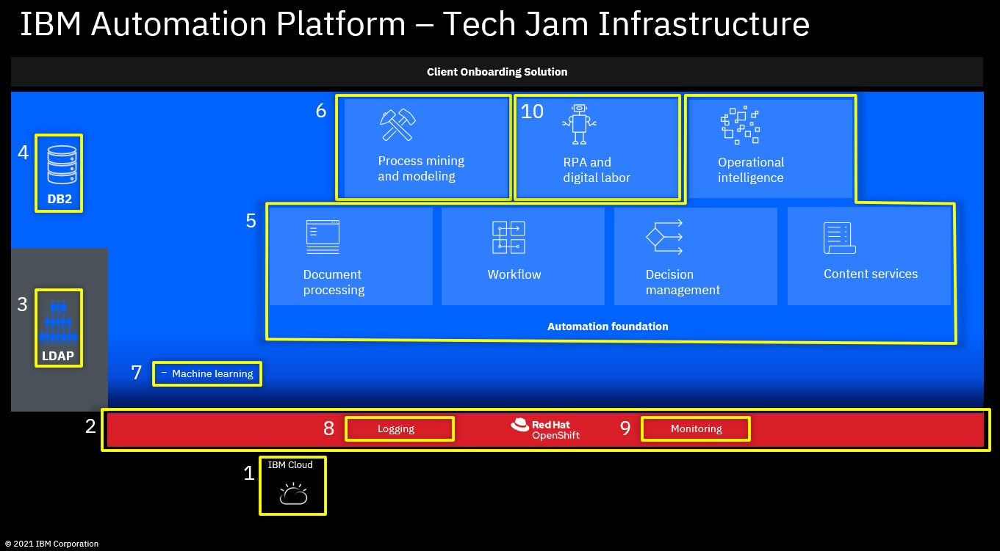

# Setting up the Tech Jam Infrastructure

This github project provides you a bunch of sample scripts and sample template files to set up the IBM Automation SWAT Client Onboarding Demo on your own environment. Other deployments are also supported.

**IMPORTANT:** The primary use for those scripts and templates is for rapid set-up of CP4BA DEMO and ENABLEMENT environments, for example to host the Client Onboarding Demo. Those scripts and templates shoud not be used to set-up customer environments for development, test, pre-production or production as they might have for example stronger security requirements. For such deployments, pls. use the official CP4BA documentation that can be found here: **https://www.ibm.com/docs/en/cloud-paks/cp-biz-automation**

**IMPORTANT:** Opening a Case against official IBM Support due to issues with these scripts or issues with the results of these scripts is not supported. Instead, IBMers can use this IBM internal Slack channel: **#dba-swat-asset-qna** (**https://ibm-cloud.slack.com/archives/C026TD1SGCA**), everyone else can open a new issue in this github.

This doc provides you step-by-step instructions to set up the needed infrastructure for the Demo or your deployment, this is:
- Install IBM Cloud Pak for Business Automation version 21.0.2 (enterprise deployment)
- Get the required infrastructure on IBM Cloud (OpenShift cluster, VM for LDAP and optionally VM for RPA)
- Installing all the prerequisite software of CP4BA (LDAP and DB2)
- Optional: Install all other components needed by the Client Onboarding Demo (Machine Learning Service needed by ADS, optionally RPA to execute some tasks by robots, Process Mining)

Once the infrastructure is set up, you are ready to import the Client Onboarding solution as documented in **[this GitHub repo](https://github.com/IBM/cp4ba-client-onboarding-scenario)**.

As of now, only OpenShift clusters with internet access (not air-gaped) are supported by these scripts (tested on IBM Cloud/ROKS and custom installed OCP - no tests made on AWS, Azure, ...). In addition, there are some other prerequisites that you need to have in place before you can start:
- Funding for the infrastructure, ~$300 as a minimum, if you plan to use ROKS
- An IBM ID to access **https://cloud.ibm.com/**, if you plan to use ROKS
- An Entitlement key that includes a license for CP4BA to pull the container images from IBM's container library cp.icr.io (see **https://myibm.ibm.com/products-services/containerlibrary**)
- A bastion host from where you are able to connect to your OpenShift cluster, the CP4BA scripts needed while the installation can be run only on Red Hat (RHEL), CentOS, and macOS
- OpenShift Command Line Interface (CLI) installed on the bastion host
- Kubernetes CLI installed on the bastion host
- The jq tool installed on the bastion host (for example you can install it with command: `yum -y install jq`)
- Podman installed on the bastion host
- Optional: A Docker account to pull images (e.g. if pulling images for postgres fails)
- Optional: git CLI installed on the bastion host (if you want to clone this gihub repository)
- Optional: Docker installed on the bastion host (if you want to deploy ADS Machine Learning Service)

For more information about those prerequisites, see also **https://www.ibm.com/docs/en/cloud-paks/cp-biz-automation/21.0.x?topic=deployments-preparing-enterprise-deployment**

With these prerequisites in place, you are ready to start with building your own infrastructure. The following picture also provides you an overview about the steps.

Follow these nine steps to set-up the Tech Jam Infrastructure:

0. **[Select the CP4BA template for deployment](00selectTemplate.md)**

1. **[Create your IBM Cloud Account (or use existing)](01createIBMCloudAccount.md)**

2. **[Create new RedHat OpenShift Cluster](02createRedHatOpenShiftCluster.md)**

3. **[Create new VSI for LDAP, install IBM SDS & import ldif files with users and groups](03createVMForLDAP.md)**

4. **[Deploy IBM DB2 Containers  &  create needed databases](04deployIBMDB2.md)**

5. **[Install IBM Cloud Pak for Business Automation Operator  &  deploy IBM Cloud Pak for Business Automation (Enterprise)](05installCP4BA.md)**

6. **[Optional: Install the Process Mining Operator & deploy Process Mining](06deployProcessMining.md)**

7. **[Optional: Deploy Machine Learning Service for ADS](07deployMLService4ADS.md)**

8. **[Optional: Setup OpenShift Logging Stack](08setupLogging.md)**

9. **[Optional: Setup OpenShift Monitoring Stack](09setupMonitoring.md)**

10. **[Optional: Create new VM for RPA  &  install IBM RPA](10createVMForRPA.md)**

11. **[Optional: Scale up the deployment](11scaleUp.md)**

Issues or questions? IBMers can use this IBM internal Slack channel: **#dba-swat-asset-qna** (**https://ibm-cloud.slack.com/archives/C026TD1SGCA**)

Everyone else can open a new issue in this github.
