# Step 2: Create new RedHat OpenShift Cluster

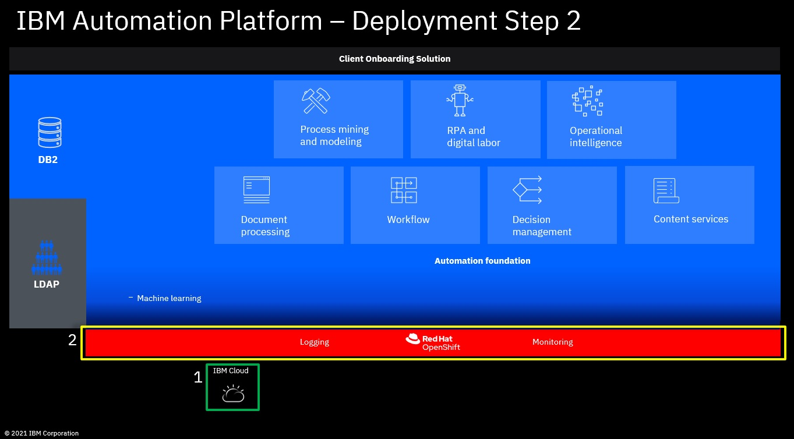

1. Access **https://cloud.ibm.com** with your IBM ID

2. Select the account under which to create the new RedHat OpenShift Cluster
   
   

3. In the top-left corner, click on the **Navigation Menu** icon
   
   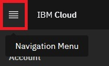

4. In the Navigation Menu select **OpenShift -> Clusters**
   
   
   
5. Click **Create cluster**

6. Select the appropriate **OpenShift Version**, 4.8.26 or a newer 4.8.x version
   
   **Note:** IBM Automation SWAT team tested only with OCP version 4.8.x, we recommend to not use older OCP versions (4.6.x is still supported by CP4BA v21.0.3 but does not contain important OCP performance fixes), CP4BA v21.0.3 is not supported any more on OCP 4.7, no tests made yet by IBM Automation SWAT team with OCP 4.9.x

7. As OCP entitlement, select **Apply my Cloud Pak OCP entitlement to this worker pool** (as this will reduce the costs for the cluster)
   
   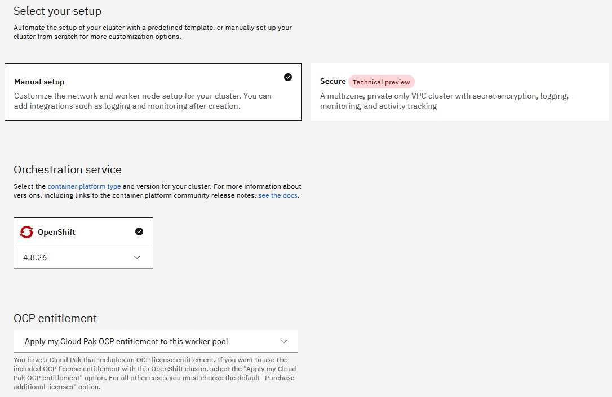
   
8. Select the **Infrastructure**, e.g., Classic

9. Select the **Geography** where you want to run your cluster, e.g., Europe

10. Set the **Availabilty** to **Single zone** (Multizone is only required for disaster recovery)

11. Select the **Worker zone** (datacenter) where the cluster should be created, e.g., Frankfurt 04
    
    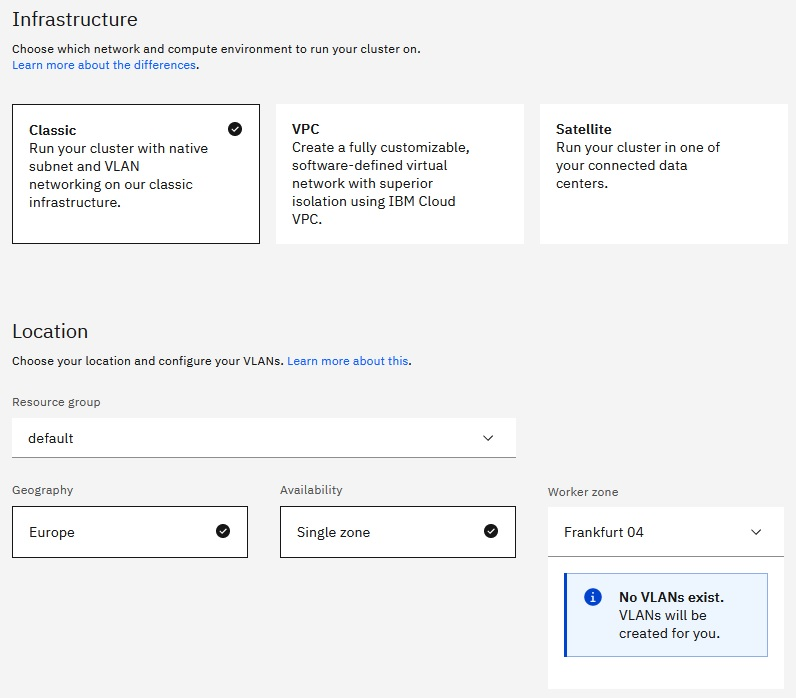
    
12. Select the **worker pool flavor**, the **amount of workers** needed and deselect **Encrypt local disk**
    
    - Select a worker pool flavor that fulfills the OCP Cluster sizing requirements of the previously selected CP4BA template (see **[Step 0: Select the CP4BA template for deployment](00selectTemplate.md)**)
    - Select the amount of workers that fulfills the OCP Cluster sizing requirements of the previously selected CP4BA template. If you plan to scale up the deployment (deploy with a pod replica size of 2 or 3 for High Availabilty) more workers/resources are needed. Optionally you can start with a replica size of 1 first and then scale up when needed - first add more workers and then increase the pod replica size, see also **[Step 11: Optional: Scale up the deployment](11scaleUp.md)**
    - Local disk encryption is not needed as we only work with sample / test data
    
    **Notes:** To save costs, you also can select Virtual - shared nodes, this is sufficient for running the Client Onboarding Demo with one or only a few users in parallel for demo purposes. Same is true for the amount of workers, when you plan to run the Demo only with one user, usually no HA is needed. If you plan to use this OpenShift cluster for higher workloads / multiple users, means you require High Availability and better/best performance, you might want to select Virtual - dedicated or even Bare metal machines and also select an higher amount of workers / a flavor that gives you more resources per worker.
    
    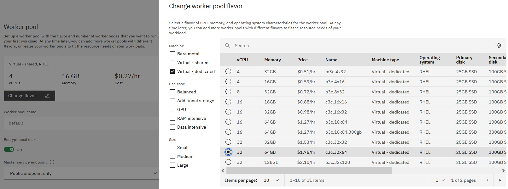
    
    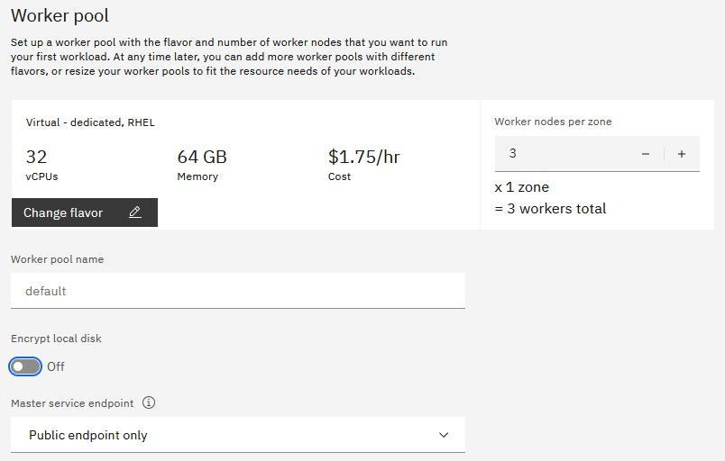
    
13. Make sure the permissions checker reports no errors and provide the **Cluster name**

    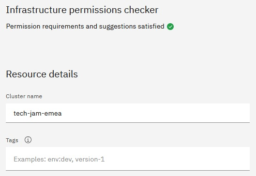

    Optionally deselect available integrations as this is only a Demo / Enablement environment
    
    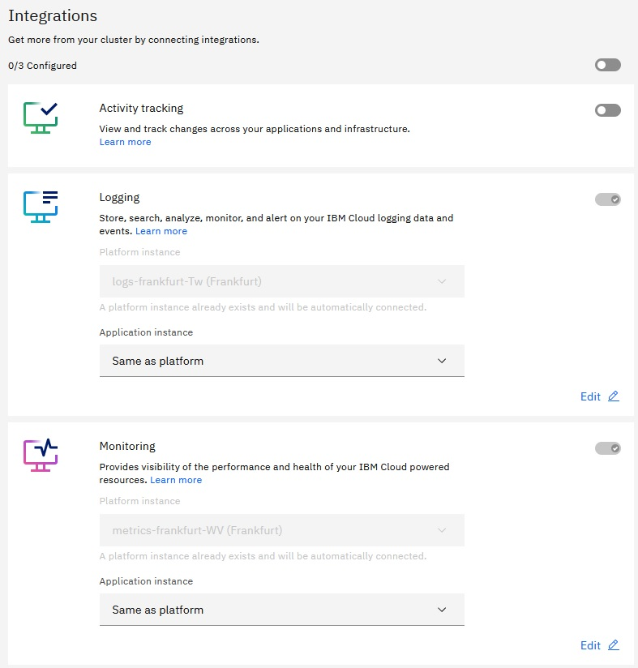

14. Review the Summary on the right hand side and click **Create**

15. Monitor the creation of your new ROKS cluster, it usually will take up to one hour to fully provision it (if you selected Bare metal, it also can take longer, dependant on the HW availability in the selected data center)

As you by default will be running DB2 containerized on the OpenShift cluster, you might need - dependant on the previously selected CP4BA template - one worker node with more memory (see **[Step 0: Select the CP4BA template for deployment](00selectTemplate.md)**) - if this is the case for your selected CP4BA template, complete the remaining sub-steps, otherwise you can proceed with **[Step 3: Create new VSI for LDAP, install IBM SDS & import ldif files with users and groups](03createVMForLDAP.md)**
    
16. Once the first worker nodes are up and running, navigate to your cluster, in the Navigation Menu select **OpenShift -> Clusters**
    
    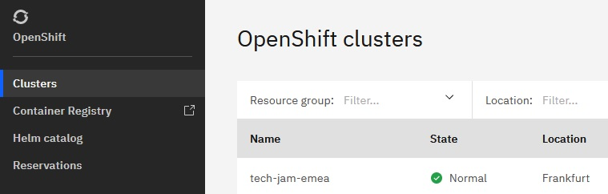
    
17. Select the cluster, e.g., tech-jam-emea, and open the **Worker pools**
    
    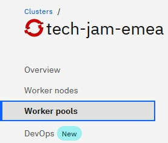
    
18. Click **Add**

19. Provide the **Worker pool name**, e.g., db2worker, and select the same **Worker zone** as selected before, e.g., Frankfurt 04 
    
    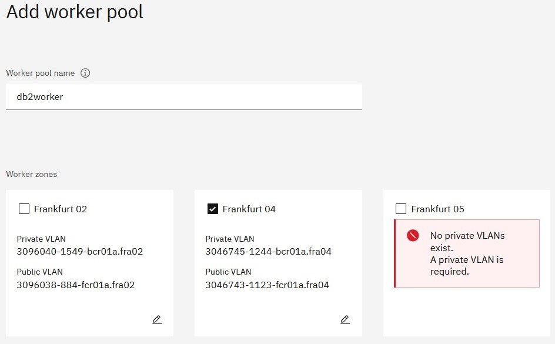
    
20. Select a **woker pool flavor** that provides you the amount of memory needed for DB2 according to the selected CP4BA template
    
    

21. Set the **amount of workers** to **1**, deselect **Encrypt local disk**, select **Apply my Cloud Pak OCP entitlement to this worker pool** and make sure the permissions checker reports no errors
    
    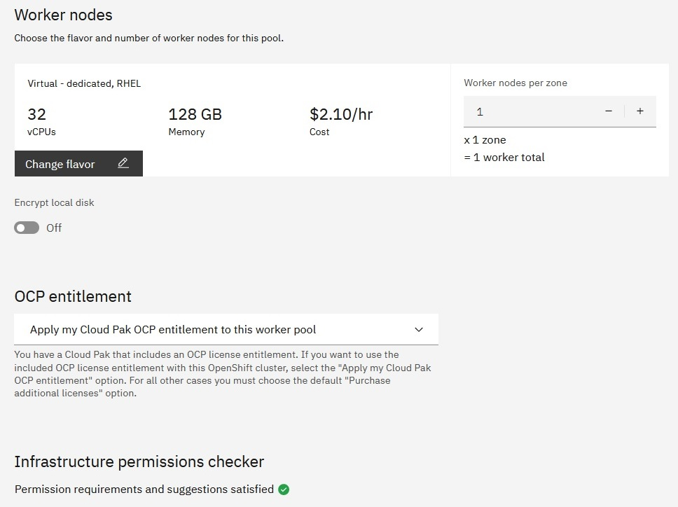

22. Review the Summary on the right hand side and click **Create**

23. Monitor the creation of your additional worker

## What to do next

Once the ROKS cluster is created, you can proceed with the next step: **[Step 3: Create new VSI for LDAP, install IBM SDS & import ldif files with users and groups](03createVMForLDAP.md)**

**[Here](Readme.md)** you can get back to the overview page

Issues or questions? IBMers can use this IBM internal Slack channel: **#dba-swat-asset-qna** (**https://ibm-cloud.slack.com/archives/C026TD1SGCA**)

Everyone else can open a new issue in this github.
