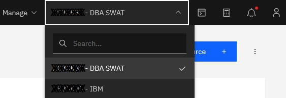
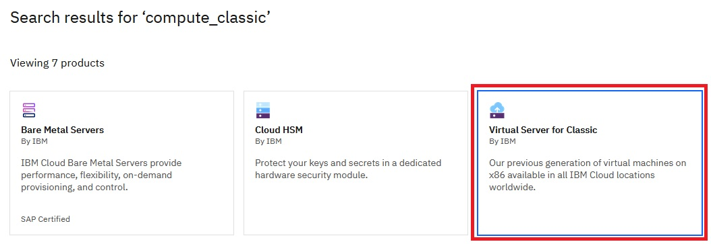
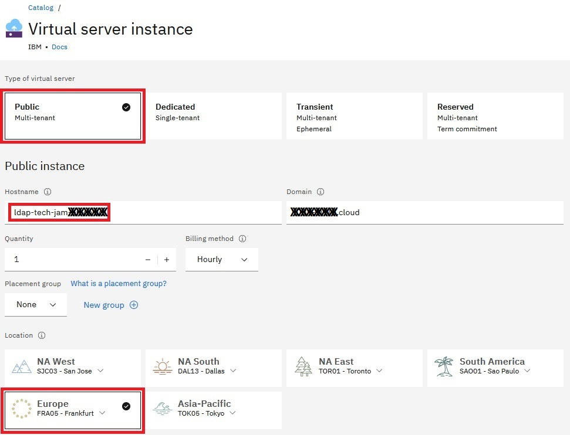
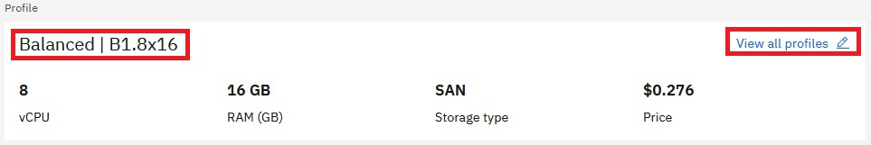
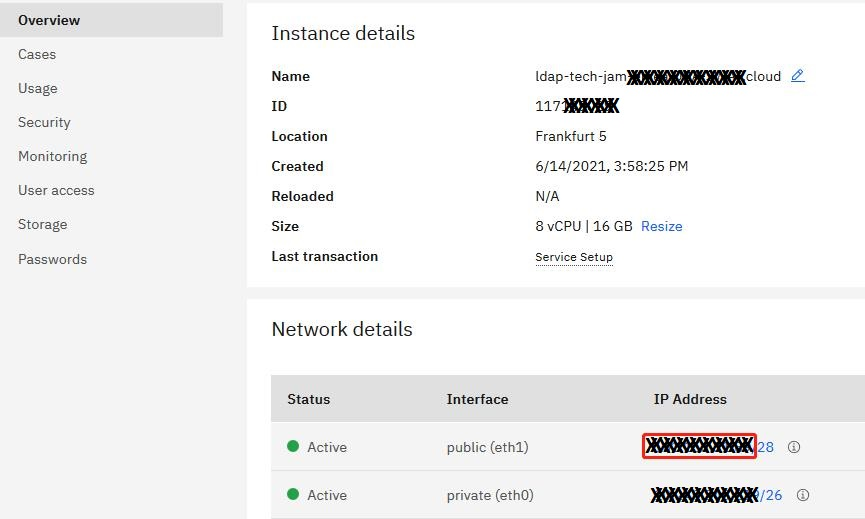

# Step 3: Create new VM for LDAP, install IBM SDS & import ldif files with users and groups


## Create new VM for LDAP

Please also refer to **https://cloud.ibm.com/docs/virtual-servers?topic=virtual-servers-ordering-vs-public**

1. Log-in to **https://cloud.ibm.com**

2. Select the **account** under which to create the new VM for LDAP
   
   

3. Click **Classic Infrastructure**

   

4. Click **Order**

   

5. Select **Virtual Server for Classic**

   

6. Select the following configuration:

   - Type of virtual server: **Public**
   - Hostname: **use any name**
   - Domain: **keep default**
     
     **Note:** The hostname plus domain name should be less than 64 characters
   - Quantity: **1**
   - Billing method: **Hourly**
   - Location: Select the same datacenter you selected for the OCP cluster

     

   - Profile: Click **View all profiles** and select **B1.8x16**

     

   - Operating system - Vendor and Version: **Red Hat** - **7.x Minimal** (please do not use Red Hat 8 as vncserver is not easily configured on v8)

     

   - Attached storage disks - Size: **100 GB**
   - Network interface - speed: **Public and Private** - **1 Gbps**
   - Private security group: **allow_all**
   - Public security group: **allow_all**
   - Private/Public VLAN/Subnet: Select the VLANs/Subnets that were created when creating the ROKS cluster

     

   - Optionally select any needed Add-ons
   
7. Review the Summary, accept the agreement and click **Create** to order the VM

     

8. After a while you can see the new VM in your device list: **https://cloud.ibm.com/gen1/infrastructure/devices**
   
9. Once it's powered on, click on the VM. On the **Overview** tab you can find the **public IP address**:

   

10. On the **Passwords** tab you can find the login credentials:

    
    
    **Note:** Public IP address and root password will be needed multiple times in the next steps to install SDS and import the ldif files
    
    **Note:** Note down the LDAP public IP address and use that while the CP4BA deployment

## Download required installation files to your bastion host and upload them to the VM

**Download/create the following files onto/on your bastion host:**
- IBM SDS 6.4 installation image (sds64-linux-x86-64.iso, part number: CN487ML, needs to be downloaded from IBM Passport Advantage, or internally from IBM Internal DSW Downloads/XL Software)
- KornShell (ksh-20120801-142.el7.x86_64.rpm, download it from http://mirror.centos.org/centos/7/os/x86_64/Packages/ksh-20120801-142.el7.x86_64.rpm, more info under https://centos.pkgs.org/7/centos-x86_64/ksh-20120801-142.el7.x86_64.rpm.html)
- libaio (libaio-0.3.109-13.el7.x86_64.rpm, download it from http://mirror.centos.org/centos/7/os/x86_64/Packages/libaio-0.3.109-13.el7.x86_64.rpm, more info under https://centos.pkgs.org/7/centos-x86_64/libaio-0.3.109-13.el7.x86_64.rpm.html)
- predefined.ldif - defines two users, `cp4badmin` and `Maureen`, and two groups, `cp4bausers` and `cp4badmins` (download it from https://github.com/IBM/cp4ba-rapid-deployment/blob/main/cp4ba-21-0-3/scripts/predefined.ldif)

  **Note:** By default the password for users `cp4badmin` and `Maureen` is `passw0rd` - if you like to modify those passwords, it's now the right time to do that: For that, open predefined.ldif with an editor of your choice, change the password and save your changes before uploading that file to the VM - make sure to note them down and use them while the CP4BA deployment and when using the components
  
  **Note:** In this scenario there are the following users and groups:
  - cp4badmin: the administrator for everything in CP4BA (see predefined.ldif)
  - cp4badmins: the administrative group, contains only cp4badmin user (see predefined.ldif)
  - usr001-usr200: common users for CP4BA (see cp4ba.ldif)
  - Maureen: common user for CP4BA (see predefined.ldif)
  - cp4bausers: the group of common users, contains usr001-usr200, Maureen and cp4badmin (see predefined.ldif)

- cp4ba.ldif - defines users `usr001` - `usr200`. Here you have two options:
  - Option 1: Use cp4ba.ldif with default passwords - in this case download it from https://github.com/IBM/cp4ba-rapid-deployment/blob/main/cp4ba-21-0-3/scripts/cp4ba.ldif
  - Option 2: Generate your own cp4ba.ldif with custom randomly generated passwords - in this case:
    - Download pwgen (pwgen-2.08-1.el7.x86_64.rpm, download it from https://download-ib01.fedoraproject.org/pub/epel/7/x86_64/Packages/p/pwgen-2.08-1.el7.x86_64.rpm, more info under https://centos.pkgs.org/7/epel-x86_64/pwgen-2.08-1.el7.x86_64.rpm.html)
    - Install pwgen onto your bastion host
      
      ```
      rpm -ivh pwgen-2.08-1.el7.x86_64.rpm
      ```
      
    - Download script to generate your own cp4ba.ldif (generateLDIF.sh, download it from https://github.com/IBM/cp4ba-rapid-deployment/blob/main/cp4ba-21-0-3/scripts/generateLDIF.sh)
    - Allow script to be executed
      
      ```
      chmod 755 generateLDIF.sh
      ```
      
    - Run the script to generate cp4ba.ldif
      
      ```
      ./generateLDIF.sh
      ```
      
      **Note:** The script will generate three files:
      - cp4ba.ldif: This is the LDIF file you need to use moving forward
      - password.txt: This is all the passwords for later use (e.g. save it to a CSV file for RPA chatbot)
      - githubpwd.txt: This file contains all passwords in special format, you can just ignore it
      
      Sample output:
      ```
      ./generateLDIF.sh
      Generating passwords...done.

      Generating LDIF file...Total 200 common users...Generating text for updating on github...done.

      Please use:
        password.txt for RPA chatbot.
        cp4ba.ldif to import user/group to LDAP.
        githubpwd.txt to update passwords on Github.
      ```

**Create on the VM a new directory for the installation files:**
- SSH to your VM
  
  ```
  ssh <vm-public-ip-address> -l root
  ```

  **Note:** The SSH service is started by default for the VM, listens on port 22 - connect to it using any SSH software

- Enter the root password
- Create new directory
  
  ```
  mkdir /root/install
  ```
  
- Logout
  
  ```
  exit
  ```

  Sample output:
  ```
  ssh xxx.xxx.xxx.xxx -l root
  root@xxx.xxx.xxx.xxx's password:
  Last login: Wed Dec  1 01:01:01 2021 from xxx.xxx.xxx.xxx
  [root@ldap-tech-jam-xxxx ~]# mkdir /root/install
  [root@ldap-tech-jam-xxxx ~]# exit
  logout
  Connection to xxx.xxx.xxx.xxx closed.
  ```

**Upload the files onto your VM:**

To upload the files from the bastion host to the VM you can use linux scp command, WinSCP, FileZilla or any software that suppports SFTP protocol

SCP command examples:

```
scp ksh-20120801-142.el7.x86_64.rpm root@<vm-public-ip-address>:/root/install/ksh-20120801-142.el7.x86_64.rpm
```

```
scp libaio-0.3.109-13.el7.x86_64.rpm root@<vm-public-ip-address>:/root/install/libaio-0.3.109-13.el7.x86_64.rpm
```

```
scp cp4ba.ldif root@<vm-public-ip-address>:/root/install/cp4ba.ldif
```

```
scp predefined.ldif root@<vm-public-ip-address>:/root/install/predefined.ldif
```

```
scp sds64-linux-x86-64.iso root@<vm-public-ip-address>:/root/install/sds64-linux-x86-64.iso
```

Sample output:
```
scp ksh-20120801-142.el7.x86_64.rpm root@xxx.xxx.xxx.xxx:/root/install/ksh-20120801-142.el7.x86_64.rpm
root@xxx.xxx.xxx.xxx's password:
ksh-20120801-142.el7.x86_64.rpm                                                       100%  884KB   2.5MB/s   00:00

scp libaio-0.3.109-13.el7.x86_64.rpm root@xxx.xxx.xxx.xxx:/root/install/libaio-0.3.109-13.el7.x86_64.rpm
root@xxx.xxx.xxx.xxx's password:
libaio-0.3.109-13.el7.x86_64.rpm                                                      100%   24KB 445.6KB/s   00:00

scp cp4ba.ldif root@xxx.xxx.xxx.xxx:/root/install/cp4ba.ldif
root@xxx.xxx.xxx.xxx's password:
cp4ba.ldif                                                                            100%   48KB 614.2KB/s   00:00

scp predefined.ldif root@xxx.xxx.xxx.xxx:/root/install/predefined.ldif
root@xxx.xxx.xxx.xxx's password:
predefined.ldif                                                                       100% 7716   159.2KB/s   00:00

scp sds64-linux-x86-64.iso root@xxx.xxx.xxx.xxx:/root/install/sds64-linux-x86-64.iso
root@xxx.xxx.xxx.xxx's password:
sds64-linux-x86-64.iso                                                                100% 2318MB   3.3MB/s   11:51
```

## Install SDS using command line

Follow these steps to install SDS:

1. SSH to your VM
   
   ```
   ssh <vm-public-ip-address> -l root
   ```

   **Note:** The SSH service is started by default for the VM, listens on port 22 - connect to it using any SSH software

2. Enter the root password

3. Change into the install directory

   ```
   cd /root/install
   ```

4. Install prerequisite RPM packages

   ```
   rpm -ivh ksh-20120801-142.el7.x86_64.rpm
   ```
   
   ```
   rpm -ivh libaio-0.3.109-13.el7.x86_64.rpm
   ```

   Sample output:
   ```
   [root@ldap-tech-jam-xxxx ~]# cd /root/install
   [root@ldap-tech-jam-xxxx install]# rpm -ivh ksh-20120801-142.el7.x86_64.rpm
   warning: ksh-20120801-142.el7.x86_64.rpm: Header V3 RSA/SHA256 Signature, key ID f4a80eb5: NOKEY
   Preparing...                          ################################# [100%]
   Updating / installing...
      1:ksh-20120801-142.el7             ################################# [100%]
   [root@ldap-tech-jam-xxxx install]# rpm -ivh libaio-0.3.109-13.el7.x86_64.rpm
   warning: libaio-0.3.109-13.el7.x86_64.rpm: Header V3 RSA/SHA256 Signature, key ID f4a80eb5: NOKEY
   Preparing...                          ################################# [100%]
   Updating / installing...
      1:libaio-0.3.109-13.el7            ################################# [100%]
   ```

5. Mount the SDS installation image

   ```
   mkdir /media/sds
   ```
   
   ```
   mount -o loop /root/install/sds64-linux-x86-64.iso /media/sds
   ```

   Sample output:
   ```
   [root@ldap-tech-jam-xxxx install]# mkdir /media/sds
   [root@ldap-tech-jam-xxxx install]# mount -o loop /root/install/sds64-linux-x86-64.iso /media/sds
   mount: /dev/loop0 is write-protected, mounting read-only
   ```
   
6. Install IBM Installation Manager

   ```
   /media/sds/ibm_im_64bit/installc -log /root/install/im_install_log.txt -acceptLicense -installationDirectory /opt/IBM/InstallationManager -showProgress
   ```

   Sample output:
   ```
   [root@ldap-tech-jam-xxxx install]# /media/sds/ibm_im_64bit/installc -log /root/install/im_install_log.txt -acceptLicense -installationDirectory /opt/IBM/InstallationManager -showProgress
                    25%                50%                75%                100%
   ------------------|------------------|------------------|------------------|
   ............................................................................
   Installed com.ibm.cic.agent_1.8.0.20140902_1503 to the /opt/IBM/InstallationManager/eclipse directory.
   ```

7. Install GSKit

   ```
   rpm -ivh /media/sds/ibm_gskit/gskcrypt64-8.0.50.34.linux.x86_64.rpm
   ```
   
   ```
   rpm -ivh /media/sds/ibm_gskit/gskssl64-8.0.50.34.linux.x86_64.rpm
   ```

   Sample output:
   ```
   [root@ldap-tech-jam-xxxx install]# rpm -ivh /media/sds/ibm_gskit/gskcrypt64-8.0.50.34.linux.x86_64.rpm
   Preparing...                          ################################# [100%]
   Updating / installing...
      1:gskcrypt64-8.0-50.34             ################################# [100%]
   [root@ldap-tech-jam-xxxx install]# rpm -ivh /media/sds/ibm_gskit/gskssl64-8.0.50.34.linux.x86_64.rpm
   Preparing...                          ################################# [100%]
   Updating / installing...
      1:gskssl64-8.0-50.34               ################################# [100%]
   ```
   
8. Create silent installation response file, copy it to /root/install folder and make it writable

   ```
   cp /media/sds/SilentInstallScripts/sds_silent_install_response.xml /root/install/sds_silent_install_response.xml
   ```
   
   ```
   chmod +w /root/install/sds_silent_install_response.xml
   ```

9. Update certain values in the silent installation response file

   ```
   sed -i "s|<install_image>|/media/sds|g" /root/install/sds_silent_install_response.xml
   ```

   ```
   sed -i "s|<DB2_Installation_Path>||g" /root/install/sds_silent_install_response.xml
   ```

   ```
   sed -i "s|<data key='user.use.existing.gskit,com.ibm.security.directoryserver.v64' value='false'/>|<data key='user.use.existing.gskit,com.ibm.security.directoryserver.v64' value='true'/>|g" /root/install/sds_silent_install_response.xml
   ```

   ```
   sed -i "s|<data key='user.gskit.executable.path,com.ibm.security.directoryserver.v64' value='/media/sds/ibm_gskit'/>|<data key='user.gskit.executable.path,com.ibm.security.directoryserver.v64' value=''/>|g" /root/install/sds_silent_install_response.xml
   ```

10. Install SDS

    ```
    /opt/IBM/InstallationManager/eclipse/tools/imcl input /root/install/sds_silent_install_response.xml -acceptLicense -showProgress
    ```

    Sample output:
    ```
    [root@ldap-tech-jam-xxxx install]# /opt/IBM/InstallationManager/eclipse/tools/imcl input /root/install/sds_silent_install_response.xml -acceptLicense -showProgress
                     25%                50%                75%                100%
    ------------------|------------------|------------------|------------------|
    ............................................................................
    Installed com.ibm.security.directoryserver.v64_6.4.0.20150225_0826 to the /opt/ibm/ldap/V6.4 directory.
    ```

## Finally, SDS needs additional configuration using command line, for example to import the ldif files

**General remark:** During the configuration, the scripts will ask for your confirmation like this:

```
Do you want to....
 (1) Continue with the above actions, or
 (2) Exit without making any changes:
```

Please answer 1 to continue


Follow these steps to configure and start SDS:

1. Create LDAP server instance:

   ```
   /opt/ibm/ldap/V6.4/sbin/idsicrt -I ldap1 -p 389 -s 636 -e mysecretkey! -G idsldap -w passw0rd
   ```
   
   **Note:** Instead of passw0rd you can define your custom password
   
   **Note:** Note down the LDAP port number, for example 389, and use that while the CP4BA deployment

   Parameters:
   - -I: server instance name: ldap1, this is also the ldap instance database user
   - -p: non-secure port: 389
   - -s: secure port: 636
   - -e: encryption seed, here `mysecretkey!` is used
   - -G: ldap instance database user group
   - -w: ldap instance database user password

   Sample output:
   ```
   [root@ldap-tech-jam-xxxx install]# /opt/ibm/ldap/V6.4/sbin/idsicrt -I ldap1 -p 389 -s 636 -e mysecretkey! -G idsldap -w passw0rd
   GLPWRP123I The program '/opt/ibm/ldap/V6.4/sbin/64/idsadduser' is used with the following arguments '-u ldap1 -g idsldap -w *****'.


   You have chosen to perform the following actions:

   GLPGRP019I System user will be created for directory server instance.
   GLPGRP020I The system user 'ldap1' will be created.
   GLPGRP021I The user's primary group 'idsldap' will be created.
   GLPGRP024I The user 'ldap1' will be a member of group 'idsldap'.
   GLPGRP025I The user 'root' will be a member of group 'idsldap'.
   GLPGRP005I The password for user 'ldap1' will be set.
   Do you want to....
    (1) Continue with the above actions, or
    (2) Exit without making any changes:1


   GLPGRP023I The default home directory for user 'ldap1' will be /home/ldap1.
   GLPGRP034I The group 'idsldap' already exists.
   GLPGRP029I The user 'ldap1' was created successfully.
   GLPGRP030I The user 'ldap1' was added to group 'idsldap' successfully.
   GLPGRP047I The user 'root' is already a member of group 'idsldap'.
   GLPGRP006I Setting the password for user 'ldap1'
   GLPGRP007I Successfully changed password for user 'ldap1'.
   GLPWRP123I The program '/opt/ibm/ldap/V6.4/sbin/64/idsicrt' is used with the following arguments 'idsicrt -I ldap1 -p 389 -s 636 -e ***** -G idsldap -w *****'.
   You have chosen to perform the following actions:

   GLPICR020I A new directory server instance 'ldap1' will be created.
   GLPICR057I The directory server instance will be created at: '/home/ldap1'.
   GLPICR013I The directory server instance's port will be set to '389'.
   GLPICR014I The directory server instance's secure port will be set to '636'.
   GLPICR015I The directory instance's administration server port will be set to '3538'.
   GLPICR016I The directory instance's administration server secure port will be set to '3539'.
   GLPICR019I The description will be set to: 'IBM Security Directory Server Instance V6.4'.
   GLPICR021I Database instance 'ldap1' will be configured.

   Do you want to....
    (1) Continue with the above actions, or
    (2) Exit without making any changes:1


   GLPICR028I Creating directory server instance: 'ldap1'.
   GLPICR025I Registering directory server instance: 'ldap1'.
   GLPICR026I Registered directory server instance: : 'ldap1'.
   GLPICR049I Creating directories for directory server instance: 'ldap1'.
   GLPICR050I Created directories for directory server instance: 'ldap1'.
   GLPICR043I Creating key stash files for directory server instance: 'ldap1'.
   GLPICR044I Created key stash files for directory server instance: 'ldap1'.
   GLPICR040I Creating configuration file for directory server instance: 'ldap1'.
   GLPICR041I Created configuration file for directory server instance: 'ldap1'.
   GLPICR034I Creating schema files for directory server instance: 'ldap1'.
   GLPICR035I Created schema files for directory server instance: 'ldap1'.
   GLPICR037I Creating log files for directory server instance: 'ldap1'.
   GLPICR038I Created log files for directory server instance: 'ldap1'.
   GLPICR088I Configuring log files for directory server instance: 'ldap1'.
   GLPICR089I Configured log files for directory server instance: 'ldap1'.
   GLPICR085I Configuring schema files for directory server instance: 'ldap1'.
   GLPICR086I Configured schema files for directory server instance: 'ldap1'.
   GLPICR073I Configuring ports and IP addresses for directory server instance: 'ldap1'.
   GLPICR074I Configured ports and IP addresses for directory server instance: 'ldap1'.
   GLPICR077I Configuring key stash files for directory server instance: 'ldap1'.
   GLPICR078I Configured key stash files for directory server instance: 'ldap1'.
   GLPICR046I Creating profile scripts for directory server instance: 'ldap1'.
   GLPICR047I Created profile scripts for directory server instance: 'ldap1'.
   GLPICR103I Adding instance information to the .profile file for directory server instance: 'ldap1'.
   GLPICR104I Added instance information to the .profile file for directory server instance: 'ldap1'.
   GLPICR069I Adding entry to /etc/inittab for the administration server for directory instance: 'ldap1'.
   GLPICR070I Added entry to /etc/inittab for the administration server for directory instance: 'ldap1'.
   GLPICR118I Creating runtime executable for directory server instance: 'ldap1'.
   GLPICR119I Created runtime executable for directory server instance: 'ldap1'.
   GLPCTL074I Starting admin server for directory server instance: 'ldap1'.
   GLPCTL075I Started admin server for directory server instance: 'ldap1'.
   GLPICR029I Created directory server instance: : 'ldap1'.
   GLPICR031I Adding database instance 'ldap1' to directory server instance: 'ldap1'.
   GLPCTL002I Creating database instance: 'ldap1'.
   GLPCTL003I Created database instance: 'ldap1'.
   GLPICR133I Setting the DB2 registry for database instance 'ldap1' to allow DB2 SELECTIVITY.
   GLPICR134I The DB2 registry for database instance 'ldap1' has been set to allow DB2 SELECTIVITY.
   GLPCTL017I Cataloging database instance node: 'ldap1'.
   GLPCTL018I Cataloged database instance node: 'ldap1'.
   GLPCTL008I Starting database manager for database instance: 'ldap1'.
   GLPCTL009I Started database manager for database instance: 'ldap1'.
   GLPCTL049I Adding TCP/IP services to database instance: 'ldap1'.
   GLPCTL050I Added TCP/IP services to database instance: 'ldap1'.
   GLPICR081I Configuring database instance 'ldap1' for directory server instance: 'ldap1'.
   GLPICR082I Configured database instance 'ldap1' for directory server instance: 'ldap1'.
   GLPICR052I Creating DB2 instance link for directory server instance: 'ldap1'.
   GLPICR053I Created DB2 instance link for directory server instance: 'ldap1'.
   GLPICR032I Added database instance 'ldap1' to directory server instance: 'ldap1'.
   ```

2. Create LDAP administrator and password:

   ```
   /opt/ibm/ldap/V6.4/sbin/idsdnpw -I ldap1 -u cn=root -p passw0rd
   ```

   **Note:** Instead of passw0rd you can define your custom password for LDAP admin user cn=root - make sure to note it down and use that while the CP4BA deployment
   
   Sample output:
   ```
   [root@ldap-tech-jam-xxxx install]# /opt/ibm/ldap/V6.4/sbin/idsdnpw -I ldap1 -u cn=root -p passw0rd
   GLPWRP123I The program '/opt/ibm/ldap/V6.4/sbin/64/idsdnpw' is used with the following arguments '-I ldap1 -u cn=root -p *****'.
   You have chosen to perform the following actions:

   GLPDPW004I The directory server administrator DN will be set.
   GLPDPW005I The directory server administrator password will be set.

   Do you want to....
    (1) Continue with the above actions, or
    (2) Exit without making any changes:1


   GLPDPW009I Setting the directory server administrator DN.
   GLPDPW010I Directory server administrator DN was set.
   GLPDPW006I Setting the directory server administrator password.
   GLPDPW007I Directory server administrator password was set.
   ```

3. Create database instance for LDAP instance:

   ```
   /opt/ibm/ldap/V6.4/sbin/idscfgdb -I ldap1 -a ldap1 -t ldap1 -l /home/ldap1 -w passw0rd
   ```
   **Note:** Instead of passw0rd you can define your custom password
   
   Parameters:
   - -I: ldap instance name
   - -a: database administrator user
   - -t: database name
   - -I: database directory
   - -w: database administrator password

   Sample output:
   ```
   [root@ldap-tech-jam-xxxx install]# /opt/ibm/ldap/V6.4/sbin/idscfgdb -I ldap1 -a ldap1 -t ldap1 -l /home/ldap1 -w passw0rd
   GLPWRP123I The program '/opt/ibm/ldap/V6.4/sbin/64/idscfgdb' is used with the following arguments '-I ldap1 -a ldap1 -t ldap1 -l /home/ldap1 -w *****'.
   You have chosen to perform the following actions:

   GLPCDB023I Database 'ldap1' will be configured.
   GLPCDB024I Database 'ldap1' will be created at '/home/ldap1'

   Do you want to....
    (1) Continue with the above actions, or
    (2) Exit without making any changes:1


   GLPCDB035I Adding database 'ldap1' to directory server instance: 'ldap1'.
   GLPCTL017I Cataloging database instance node: 'ldap1'.
   GLPCTL018I Cataloged database instance node: 'ldap1'.
   GLPCTL008I Starting database manager for database instance: 'ldap1'.
   GLPCTL009I Started database manager for database instance: 'ldap1'.
   GLPCTL026I Creating database: 'ldap1'.
   GLPCTL027I Created database: 'ldap1'.
   GLPCTL034I Updating the database: 'ldap1'
   GLPCTL035I Updated the database: 'ldap1'
   GLPCTL020I Updating the database manager: 'ldap1'.
   GLPCTL021I Updated the database manager: 'ldap1'.
   GLPCTL023I Enabling multi-page file allocation: 'ldap1'
   GLPCTL024I Enabled multi-page file allocation: 'ldap1'
   GLPCDB005I Configuring database 'ldap1' for directory server instance: 'ldap1'.
   GLPCDB006I Configured database 'ldap1' for directory server instance: 'ldap1'.
   GLPCTL037I Adding local loopback to database: 'ldap1'.
   GLPCTL038I Added local loopback to database: 'ldap1'.
   GLPCTL011I Stopping database manager for the database instance: 'ldap1'.
   GLPCTL012I Stopped database manager for the database instance: 'ldap1'.
   GLPCTL008I Starting database manager for database instance: 'ldap1'.
   GLPCTL009I Started database manager for database instance: 'ldap1'.
   GLPCDB003I Added database 'ldap1' to directory server instance: 'ldap1'.
   ```

4. Add suffix `dc=example,dc=com`:

   ```
   /opt/ibm/ldap/V6.4/sbin/idscfgsuf -I ldap1 -s "dc=example,dc=com"
   ```

   Sample output:
   ```
   [root@ldap-tech-jam-xxxx install]# /opt/ibm/ldap/V6.4/sbin/idscfgsuf -I ldap1 -s "dc=example,dc=com"
   GLPWRP123I The program '/opt/ibm/ldap/V6.4/sbin/64/idscfgsuf' is used with the following arguments '-I ldap1 -s dc=example,dc=com'.
   You have chosen to perform the following actions:

   GLPCSF007I Suffix 'dc=example,dc=com' will be added to the configuration file of the directory server instance 'ldap1'.

   Do you want to....
    (1) Continue with the above actions, or
    (2) Exit without making any changes:1


   GLPCSF004I Adding suffix: 'dc=example,dc=com'.
   GLPCSF005I Added suffix: 'dc=example,dc=com'.
   ```

5. Import the LDIF files:

   ```
   /opt/ibm/ldap/V6.4/sbin/ldif2db -i /root/install/cp4ba.ldif -I ldap1
   ```
   
   ```
   /opt/ibm/ldap/V6.4/sbin/ldif2db -i /root/install/predefined.ldif -I ldap1
   ```

   Sample output:
   ```
   [root@ldap-tech-jam-xxxx install]# /opt/ibm/ldap/V6.4/sbin/ldif2db -i /root/install/cp4ba.ldif -I ldap1
   GLPCTL113I Largest core file size creation limit for the process (in bytes): '0'(Soft limit) and '-1'(Hard limit).
   GLPCTL119I Maximum Data Segment(Kbytes) soft ulimit for the process is -1 and the prescribed minimum is 262144.
   GLPCTL119I Maximum File Size(512 bytes block) soft ulimit for the process is -1 and the prescribed minimum is 2097152.
   GLPCTL122I Maximum Open Files soft ulimit for the process is 1024 and the prescribed minimum is 500.
   GLPCTL121I Maximum Stack Size(Kbytes) soft ulimit for the process was 8192 and it is modified to the prescribed minimum 10240.
   GLPCTL119I Maximum Virtual Memory(Kbytes) soft ulimit for the process is -1 and the prescribed minimum is 1048576.
   GLPCOM022I The database plugin is successfully loaded from libback-config.so.
   GLPSRV221I Replication of security attributes feature is disabled.
   GLPSRV200I Initializing primary database and its connections.
   GLPRPL137I Restricted Access to the replication topology is set to false.
   GLPRDB107I The suffix entry DC=EXAMPLE,DC=COM has been created.
   GLPL2D003I ldif2db: 100 entries have been processed.
   GLPRDB002W ldif2db: 200 entries have been successfully added out of 200 attempted.
   [root@ldap-tech-jam-xxxx install]# /opt/ibm/ldap/V6.4/sbin/ldif2db -i /root/install/predefined.ldif -I ldap1
   GLPCTL113I Largest core file size creation limit for the process (in bytes): '0'(Soft limit) and '-1'(Hard limit).
   GLPCTL119I Maximum Data Segment(Kbytes) soft ulimit for the process is -1 and the prescribed minimum is 262144.
   GLPCTL119I Maximum File Size(512 bytes block) soft ulimit for the process is -1 and the prescribed minimum is 2097152.
   GLPCTL122I Maximum Open Files soft ulimit for the process is 1024 and the prescribed minimum is 500.
   GLPCTL121I Maximum Stack Size(Kbytes) soft ulimit for the process was 8192 and it is modified to the prescribed minimum 10240.
   GLPCTL119I Maximum Virtual Memory(Kbytes) soft ulimit for the process is -1 and the prescribed minimum is 1048576.
   GLPCOM022I The database plugin is successfully loaded from libback-config.so.
   GLPSRV221I Replication of security attributes feature is disabled.
   GLPSRV200I Initializing primary database and its connections.
   GLPRPL137I Restricted Access to the replication topology is set to false.
   GLPRDB002W ldif2db: 3 entries have been successfully added out of 3 attempted.
   ```

6. Finally, start the LDAP server:
   
   ```
   /opt/ibm/ldap/V6.4/sbin/idsslapd -I ldap1
   ```

   Sample output:
   ```
   [root@ldap-tech-jam-xxxx install]# /opt/ibm/ldap/V6.4/sbin/idsslapd -I ldap1
   GLPSRV041I Server starting.
   GLPSRV236W Premium feature activation code could not be loaded. Some features are not available.
   GLPCTL113I Largest core file size creation limit for the process (in bytes): '0'(Soft limit) and '-1'(Hard limit).
   GLPCTL119I Maximum Data Segment(Kbytes) soft ulimit for the process is -1 and the prescribed minimum is 262144.
   GLPCTL119I Maximum File Size(512 bytes block) soft ulimit for the process is -1 and the prescribed minimum is 2097152.
   GLPCTL122I Maximum Open Files soft ulimit for the process is 1024 and the prescribed minimum is 500.
   GLPCTL121I Maximum Stack Size(Kbytes) soft ulimit for the process was 8192 and it is modified to the prescribed minimum 10240.
   GLPCTL119I Maximum Virtual Memory(Kbytes) soft ulimit for the process is -1 and the prescribed minimum is 1048576.
   GLPCOM024I The extended Operation plugin is successfully loaded from libevent.so.
   GLPCOM024I The extended Operation plugin is successfully loaded from libtranext.so.
   GLPCOM024I The extended Operation plugin is successfully loaded from libldaprepl.so.
   GLPSRV155I The DIGEST-MD5 SASL Bind mechanism is enabled in the configuration file.
   GLPCOM021I The preoperation plugin is successfully loaded from libDigest.so.
   GLPCOM024I The extended Operation plugin is successfully loaded from libevent.so.
   GLPCOM024I The extended Operation plugin is successfully loaded from libtranext.so.
   GLPCOM023I The postoperation plugin is successfully loaded from libpsearch.so.
   GLPCOM024I The extended Operation plugin is successfully loaded from libpsearch.so.
   GLPCOM025I The audit plugin is successfully loaded from libldapaudit.so.
   GLPCOM024I The extended Operation plugin is successfully loaded from libevent.so.
   GLPCOM023I The postoperation plugin is successfully loaded from libpsearch.so.
   GLPCOM024I The extended Operation plugin is successfully loaded from libpsearch.so.
   GLPCOM022I The database plugin is successfully loaded from libback-config.so.
   GLPCOM024I The extended Operation plugin is successfully loaded from libevent.so.
   GLPCOM024I The extended Operation plugin is successfully loaded from libtranext.so.
   GLPCOM023I The postoperation plugin is successfully loaded from libpsearch.so.
   GLPCOM024I The extended Operation plugin is successfully loaded from libpsearch.so.
   GLPCOM022I The database plugin is successfully loaded from libback-rdbm.so.
   GLPCOM010I Replication plugin is successfully loaded from libldaprepl.so.
   GLPSRV189I Virtual list view support is enabled.
   GLPCOM021I The preoperation plugin is successfully loaded from libpta.so.
   GLPSRV194I The Record Deleted Entries feature is disabled. Deleted entries are immediately removed from the database.
   GLPSRV207I Group conflict resolution during replication is disabled.
   GLPSRV221I Replication of security attributes feature is disabled.
   GLPSRV200I Initializing primary database and its connections.
   GLPRDB126I The directory server will not use DB2 selectivity.
   GLPCOM024I The extended Operation plugin is successfully loaded from libloga.so.
   GLPCOM024I The extended Operation plugin is successfully loaded from libidsfget.so.
   GLPSRV232I Pass-through authentication is disabled.
   GLPSRV234I Pass-through support for compare operations is disabled.
   GLPCOM003I Non-SSL port initialized to 389.
   ```

## What to do next

You can now proceed with **[Step 4: Deploy IBM DB2 Containers  &  create needed databases](04deployIBMDB2.md)**

**[Here](Readme.md)** you can get back to the overview page

Issues or questions? IBMers can use this IBM internal Slack channel: **#dba-swat-asset-qna** (**https://ibm-cloud.slack.com/archives/C026TD1SGCA**)

Everyone else can open a new issue in this github.
