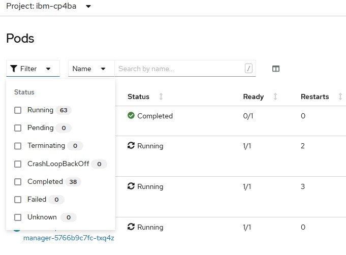
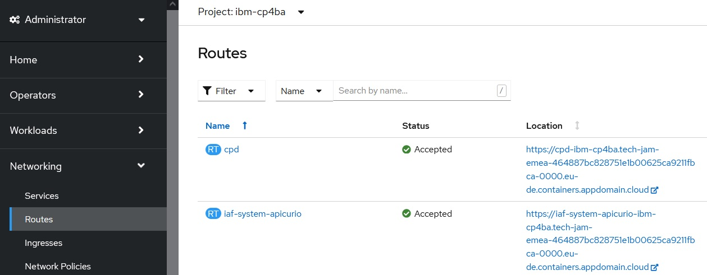

# Step 5: Install IBM Cloud Pak for Business Automation Operator & deploy IBM Cloud Pak for Business Automation (Production)


1. Onto your bastion host, download the Case package: **https://github.com/IBM/cloud-pak/raw/master/repo/case/ibm-cp-automation-3.2.5.tgz** into a temporary directory, e.g., `/temp`, and extract `ibm-cp-automation-3.2.5.tar` into the same temporary directory, e.g., `/temp`

2. Extract the content of `ibm-cp-automation-3.2.5.tar` into the same temporary directory, e.g., `/temp`

3. Extract the content of archive `/temp/ibm-cp-automation/inventory/cp4aOperatorSdk/files/deploy/crs/cert-k8s-21.0.3.tar` into directory `/cp4ba`

4. If you are deploying on a ROKS cluster, copy the modified storage class definitions so that CP4BA Operator is using them (in this version of the storage classes the reclaimPolicy got changed to Delete and the name got adapted, because Delete is usually the better reclaimPolicy for ROKS and Demo environments)
   
   ```
   cp /cp4ba/cp4ba-rapid-deployment/cp4ba-21-0-3/mycluster/deployment-db2-cp4ba/cp4a-*-storage-class.yaml /cp4ba/cert-kubernetes/descriptors/
   ```
   
   For example:
   
   ```
   cp /cp4ba/cp4ba-rapid-deployment/cp4ba-21-0-3/mycluster/deployment-db2-cp4ba/cp4a-*-storage-class.yaml /cp4ba/cert-kubernetes/descriptors/
   cp: overwrite ‘cp4ba/cert-kubernetes/descriptors/cp4a-bronze-storage-class.yaml’? y
   cp: overwrite ‘cp4ba/cert-kubernetes/descriptors/cp4a-gold-storage-class.yaml’? y
   cp: overwrite ‘cp4ba/cert-kubernetes/descriptors/cp4a-silver-storage-class.yaml’? y
   ```

5. From cert-kubernetes, execute script **cp4a-clusteradmin-setup.sh**
   
   ```
   cd /cp4ba/cert-kubernetes/scripts/
   ```
   
   ```
   ./cp4a-clusteradmin-setup.sh
   ```
   
   Sample script output
   
   ```
   creating temp folder
   
   Select the cloud platform to deploy: 
   1) RedHat OpenShift Kubernetes Service (ROKS) - Public Cloud
   2) Openshift Container Platform (OCP) - Private Cloud
   3) Other ( Certified Kubernetes Cloud Platform / CNCF)
   Enter a valid option [1 to 3]: 1
   
   
   
   This script prepares the OLM for the deployment of some Cloud Pak for Business Automation capabilities 
   
   What type of deployment is being performed?
   1) Starter
   2) Production
   Enter a valid option [1 to 2]: 2
   
   Do you want CP4BA Operator support 'All Namespaces'? (Yes/No, default: No) n
   
   Where do you want to deploy Cloud Pak for Business Automation?
   Enter the name for a new project or an existing project (namespace): <your-ibm-cp4ba-project>
   
   The Cloud Pak for Business Automation Operator (Pod, CSV, Subscription) not found in cluster
   Continue....
   
   Using project <your-ibm-cp4ba-project>...
   
   Here are the existing users on this cluster:
   <list of users>
   Enter an existing username in your cluster, valid option [1 to X], non-admin is suggested: <select a number>

   Follow the instructions on how to get your Entitlement Key: 
   https://www.ibm.com/support/knowledgecenter/en/SSYHZ8_21.0.x/com.ibm.dba.install/op_topics/tsk_images_enterp_entitled.html
   
   Do you have a Cloud Pak for Business Automation Entitlement Registry key (Yes/No, default: No): y
   
   Enter your Entitlement Registry key: 
   Verifying the Entitlement Registry key...
   Login Succeeded!
   Entitlement Registry key is valid.
   
   Create storage classes for deployment: Done 
   
   The existing storage classes in the cluster: 
   NAME                                  PROVISIONER         RECLAIMPOLICY   VOLUMEBINDINGMODE   ALLOWVOLUMEEXPANSION   AGE
   cp4a-file-delete-bronze-gid           ibm.io/ibmc-file    Delete          Immediate           false                  1m
   cp4a-file-delete-gold-gid (default)   ibm.io/ibmc-file    Delete          Immediate           false                  1m
   cp4a-file-delete-silver-gid           ibm.io/ibmc-file    Delete          Immediate           false                  1m
   <your-list-of-storage classes>
   
   To provision the persistent volumes and volume claims
   please enter the dynamic storage classname for fast storage: cp4a-file-delete-gold-gid
   Creating docker-registry secret for Entitlement Registry key in project <your-ibm-cp4ba-project>...
   secret/admin.registrykey created
   Done
   Creating ibm-entitlement-key secret for IAF in project <your-ibm-cp4ba-project>...
   secret/ibm-entitlement-key created
   Done
   
   Applying the persistent volumes for the Cloud Pak operator by using the storage classname: cp4a-file-delete-gold-gid...
   
   persistentvolumeclaim/operator-shared-pvc created
   persistentvolumeclaim/cp4a-shared-log-pvc created
   Done
   
   Waiting for the persistent volumes to be ready...
   ......
   ......
   ......
   ......
   ......
   ......
   ......
   ......
   ......
   ......
   ......
   Done
   ibm-operator-catalog   IBM Operator Catalog   grpc   IBM         1m
   Found existing ibm operator catalog source, updating it
   catalogsource.operators.coreos.com/ibm-operator-catalog configured
   IBM Operator Catalog source updated!
   Waiting for CP4A Operator Catalog pod initialization
   Waiting for CP4A Operator Catalog pod initialization
   CP4BA Operator Catalog is running ibm-operator-catalog-97xx4                                        1/1   Running     0     30s
   operatorgroup.operators.coreos.com/ibm-cp4a-operator-catalog-group created
   CP4BA Operator Group Created!
   subscription.operators.coreos.com/ibm-cp4a-operator-catalog-subscription created
   CP4BA Operator Subscription Created!
   Waiting for CP4BA operator pod initialization
   No resources found in <your-ibm-cp4ba-project> namespace.
   Waiting for CP4BA operator pod initialization
   No resources found in <your-ibm-cp4ba-project> namespace.
   Waiting for CP4BA operator pod initialization
   No resources found in <your-ibm-cp4ba-project> namespace.
   Waiting for CP4BA operator pod initialization
   Waiting for CP4BA operator pod initialization
   Waiting for CP4BA operator pod initialization
   Waiting for CP4BA operator pod initialization
   Waiting for CP4BA operator pod initialization
   CP4A operator is running ibm-cp4a-operator-7dbfc56cdb-h7zrk                                1/1   Running             0     114s
   
   Adding the user <your-selected-user> to the ibm-cp4a-operator role...Done!
   
   Label the default namespace to allow network policies to open traffic to the ingress controller using a
   namespaceSelector...namespace/default labeled
   Done
   
   Storage classes are needed to run the deployment script. For the Starter deployment scenario, you may use one (1) storage class.
   For an Production deployment, the deployment script will ask for three (3) storage classes to meet the slow, medium, and fast
   storage for the configuration of CP4A components.  If you don't have three (3) storage classes, you can use the same one for
   slow, medium, or fast.  Note that you can get the existing storage class(es) in the environment by running the following
   command: oc get storageclass. Take note of the storage classes that you want to use for deployment. 
   NAME                                  PROVISIONER         RECLAIMPOLICY   VOLUMEBINDINGMODE   ALLOWVOLUMEEXPANSION   AGE
   cp4a-file-delete-bronze-gid           ibm.io/ibmc-file    Delete          Immediate           false                  2m
   cp4a-file-delete-gold-gid (default)   ibm.io/ibmc-file    Delete          Immediate           false                  2m
   cp4a-file-delete-silver-gid           ibm.io/ibmc-file    Delete          Immediate           false                  2m
   <your-list-of-storage classes>
   ```
   
   The progress of the script can be monitored on a separate terminal by checking the output of the command
   
   ```
   watch -n 10 oc get pvc,csv,pod
   ```
   
   First you should see that the two persistent volume claims are get bound. Then the deployment of the 9 operators can be seen, and last but not least, the 9 pods implementing those operators should be getting deployed and running.

6. Wait untill all Operators are installed, this might take a while (you need to see e.g. 9 pods in \<your-ibm-cp4ba-project\>, 12 pods in ibm-common-services project, all Running and Ready 1/1)
   
   **Note:** The number of pods can vary based on when you install and what version of the Operators is installed. Important is that all are Running and Ready.

7. In folder **deployment-db2-cp4ba** update the properties file for CP4BA **05-parametersForCp4ba.sh**, provide the following properties:

   - `cp4baProjectName`, e.g., `ibm-cp4ba` - make sure to use the same value as used before when running script cp4a-clusteradmin-setup.sh
   - `cp4baTlsSecretName` - see also secret name in project ibm-cert-store on ROKS, if you are not deploying on ROKS leave empty
   - `cp4baAdminPassword`, e.g., `passw0rd` - use the password for user cp4badmin in the generated .ldif file when setting up LDAP
   - `ldapAdminPassword`, e.g., `passw0rd` - use the password that you specified for cn=root when setting up LDAP
   - `ldapServer`, e.g., `123.456.679.012` - the hostname or IP of the previously installed LDAP server
   
   **Note:** Also review the other properties, in case changes are needed, e.g., in case you are not deploying on ROKS, also provide correct Storage Class values for properties `cp4baScSlow`, `cp4baScMedium` and `cp4baScFast`. These Storage Classes have to provide RWX storage, for more details about storage for CP4BA, see also **https://www.ibm.com/docs/en/cloud-paks/cp-biz-automation/21.0.3?topic=ppd-storage-considerations**.

8. Cloud Pak for Business Automation Version 21.0.3 has a known Issue. The IAF Framework is unable to pull some of the container images, because the service account it is using is missing the secret which authorizes it on the IBM Registry, see **https://www.ibm.com/support/pages/node/6426995** for details. To work around it apply the workaround given on the webpage, as soon as the mentioned service account has been created. Note that this is only needed, if the mentioned container images have not yet been loaded by the nodes, where the pods have been scheduled to execute.

9. Run script **07-createCp4baDeployment.sh**
   
   ```
   cd /cp4ba/cp4ba-rapid-deployment/cp4ba-21-0-3/mycluster/deployment-db2-cp4ba
   ```
   
   ```
   ./07-createCp4baDeployment.sh
   ```
   
   Sample script output
   
   ```
   Found 01-parametersForDb2OnOCP.sh.  Reading in variables from that script.
     Reading 01-parametersForDb2OnOCP.sh ...
   Done!
   
   Found 05-parametersForCp4ba.sh.  Reading in variables from that script.
     Reading 05-parametersForCp4ba.sh ...
   Extracting OCP Hostname
   OCPHostname set to <your-hostname>
   Done!
   
   This script PREPARES and optionaly CREATES the CP4BA deployment using template <your-selected-template> in
   project <your-ibm-cp4ba-project>.
   
   Are 01-parametersForDb2OnOCP.sh and 05-parametersForCp4ba.sh up to date, and do you want to continue? (Yes/No, default: No): y
   
   Preparing the CP4BA deployment...
   
   Switching to project <your-ibm-cp4ba-project>...
   Already on project "<your-ibm-cp4ba-project>" on server "https://<your-server>:<your-port>".
   
   Collecting information for secret ibm-entitlement-key. For this, your Entitlement Registry key is needed.
   
   You can get the Entitlement Registry key from here: https://myibm.ibm.com/products-services/containerlibrary
   
   Enter your Entitlement Registry key: 
   Verifying the Entitlement Registry key...
   Login Succeeded!
   Entitlement Registry key is valid.
   
   Copying jdbc for Db2 from Db2 container to local disk...
   Now using project "<your-ibm-db2-project>" on server "https://<your-server>:<your-port>".
   tar: Removing leading `/' from member names
   tar: Removing leading `/' from member names
   Now using project "<your-ibm-cp4ba-project>" on server "https://<your-server>:<your-port>".
   
   Preparing the CP4BA secrets...
   
   Preparing the tls secret...
   Now using project "ibm-cert-store" on server "https://<your-server>:<your-port>".
   Now using project "<your-ibm-cp4ba-project>" on server "https://<your-server>:<your-port>".
   
   Preparing the CR YAML for deployment...
   
   All artefacts for deployment are prepared.
   
   Do you want to CREATE the CP4BA deployment in project <your-ibm-cp4ba-project> now? (Yes/No, default: No): y
   
   Creating the CP4BA deployment...
   
   Creating secret ibm-entitlement-key in project ibm-common-services...
   Now using project "ibm-common-services" on server "https://<your-server>:<your-port>".
   secret/ibm-entitlement-key created
   Now using project "<your-ibm-cp4ba-project>" on server "https://<your-server>:<your-port>".
   Done.
   
   Copying the jdbc driver to ibm-cp4a-operator...
   Done.
   
   Creating CP4BA secrets...
   secret/ldap-bind-secret created
   secret/icp4a-shared-encryption-key created
   secret/resource-registry-admin-secret created
   secret/ibm-ban-secret created
   secret/ibm-fncm-secret created
   secret/icp4adeploy-bas-admin-secret created
   secret/playback-server-admin-secret created
   secret/icp4adeploy-workspace-aae-app-engine-admin-secret created
   secret/ibm-adp-secret created
   secret/ibm-bawaut-server-db-secret created
   secret/ibm-pfs-admin-secret created
   secret/ibm-bawaut-admin-secret created
   Done.
   
   Creating the tls secret...
   secret/icp4a-tls-secret created
   Done.
   
   Creating the CP4BA deployment...
   icp4acluster.icp4a.ibm.com/icp4adeploy created
   Done.
   
   All changes got applied. Exiting...
   ```

10. The deployment of CP4BA might now take several hours dependant on the CP4BA template that you selected. Monitor the logs of the Operator to spot any potential issues.

    **Note:** In case you have not used a DB2 Standard Edition license key or enough memory for the DB2, closely monitor the operator logs. This configuration might result in issues when deploying CP4BA, as it might happen that the CPE Object Stores can't be automatically initialized while the deployment as the DB connections might not be able to be created. In that case, scale down the operator to zero after the Object Store initialization failed and create the missing DB connections manually. Then, scale up the operator to one and it will usually initialze the Object Stores.

11. The CP4BA deployment is complete when you see:
    - for template **Client Onboarding Demo with ADP**: in your **CP4BA project** about 84 Running and Ready pods, and about 39 Completed pods, but no Pending / CrashLoopBackOff pods, plus in project **ibm-common-services** about 37 Running and Ready pods, and about 9 Completed pods, but no Pending / CrashLoopBackOff pods
    - for template **Foundation, Content**: in your **CP4BA project** about 30 Running and Ready pods, and about 10 Completed pods, but no Pending / CrashLoopBackOff pods, plus in project **ibm-common-services** about 32 Running and Ready pods, and about 9 Completed pods, but no Pending / CrashLoopBackOff pods
    - for template **Foundation**: in your **CP4BA project** about TODO Running and Ready pods, and about TODO Completed pods, but no Pending / CrashLoopBackOff pods, plus in project **ibm-common-services** about TODO Running and Ready pods, and about TODO Completed pods, but no Pending / CrashLoopBackOff pods
    
    **Note:** It might be that some pods are in Failed or Error state, for those make sure there is another instance of that pod in Completed state. If this is the case, you can delete the Failed or Error pods. If there are pods in Failed or Error state where there is no other instance of that pod in Completed state, the deployment is not healthy.
    
    **Note:** It might be that going forward the number of pods mentioned here does change, as with every new installation latest versions of ibm-common-services and IBM Automation Foundation are installed and those latest versions might come with a different number of Running and / or Completed pods. The most important point here is that you don't see pods in any other state (Pending / CrashLoopBackOff / Failed / Error / ...).
    
    For example, when you selected the Template **Client Onboarding Demo with ADP**, you shoud see the following:
    
    
    
    ```
    oc get pods
    NAME                                                              READY   STATUS      RESTARTS   AGE
    create-secrets-job-nkphk                                          0/1     Completed   0          14h
    iaf-core-operator-controller-manager-794f4586c5-9fwv4             1/1     Running     2          46h
    iaf-eventprocessing-operator-controller-manager-7b4f454fb544gdz   1/1     Running     3          46h
    iaf-flink-operator-controller-manager-5766b9c7fc-txq4z            1/1     Running     0          46h
    iaf-insights-engine--7fc4-eve-29ee-ep-jobmanager-0                2/2     Running     0          128m
    iaf-insights-engine--7fc4-eve-29ee-ep-taskmanager-0               1/1     Running     0          127m
    iaf-insights-engine--7fc4-eve-29ee-ep-taskmanager-1               1/1     Running     0          127m
    iaf-insights-engine--7fc4-eve-29ee-ep-taskmanager-2               1/1     Running     0          127m
    iaf-insights-engine--7fc4-eve-29ee-ep-taskmanager-3               1/1     Running     0          127m
    iaf-insights-engine-application-setup-nxr2x                       0/1     Completed   0          126m
    iaf-insights-engine-cockpit-854b888f47-rh8cn                      1/1     Running     0          126m
    iaf-insights-engine-event-forwarder-zhp9p                         0/1     Completed   0          126m
    iaf-insights-engine-management-85d8bb559d-8wq24                   2/2     Running     0          126m
    iaf-insights-engine-operator-controller-manager-676f8c77fbwm8xh   1/1     Running     0          46h
    iaf-operator-controller-manager-65b548c995-z8sfd                  1/1     Running     2          46h
    iaf-system-apicurio-59f595b777-z5nmd                              1/1     Running     0          14h
    iaf-system-elasticsearch-es-data-0                                2/2     Running     0          14h
    iaf-system-entity-operator-865d698db6-t5mlf                       3/3     Running     0          14h
    iaf-system-kafka-0                                                1/1     Running     0          14h
    iaf-system-zookeeper-0                                            1/1     Running     0          14h
    iaf-zen-tour-job-t8hrw                                            0/1     Completed   0          14h
    iam-config-job-v67xc                                              0/1     Completed   0          14h
    ibm-bts-cnpg-ibm-cp4ba-cp4ba-bts-1                                1/1     Running     0          3h18m
    ibm-bts-cp4ba-bts-deployment-576955c75b-bpv6t                     1/1     Running     0          3h17m
    ibm-common-service-operator-57d475879-vkhwg                       1/1     Running     0          46h
    ibm-cp4a-operator-f9945474d-5tlbp                                 1/1     Running     0          16h
    ibm-cp4a-wfps-operator-controller-manager-899876dbb-jmhcq         1/1     Running     0          46h
    ibm-elastic-operator-controller-manager-555b7fb6f9-769zh          1/1     Running     2          46h
    ibm-nginx-7d9486fb9d-wks6q                                        1/1     Running     0          14h
    ibm-nginx-7d9486fb9d-wr6hq                                        1/1     Running     0          14h
    icp4adeploy-ads-credentials-service-56f74d85c7-fwqg5              1/1     Running     0          94m
    icp4adeploy-ads-download-service-c9d87f84f-c5nh5                  1/1     Running     0          94m
    icp4adeploy-ads-embedded-build-service-84f7d6b55b-2f47v           1/1     Running     0          94m
    icp4adeploy-ads-front-548b76b94c-5nczm                            1/1     Running     0          94m
    icp4adeploy-ads-git-service-7db7bb48f4-js4xd                      1/1     Running     0          94m
    icp4adeploy-ads-ltpa-creation-zq8dw                               0/1     Completed   0          94m
    icp4adeploy-ads-mongo-6984b8cfd4-fqwlk                            1/1     Running     0          94m
    icp4adeploy-ads-parsing-service-845585cd88-smzqt                  1/1     Running     0          94m
    icp4adeploy-ads-rest-api-594fb9cb74-cdc25                         1/1     Running     0          94m
    icp4adeploy-ads-rr-as-runtime-synchro-27387885-tfkjb              0/1     Completed   0          43m
    icp4adeploy-ads-rr-as-runtime-synchro-27387900-zqrfc              0/1     Completed   0          28m
    icp4adeploy-ads-rr-as-runtime-synchro-27387915-2lvfk              0/1     Completed   0          13m
    icp4adeploy-ads-rr-registration-27387885-fb4zr                    0/1     Completed   0          43m
    icp4adeploy-ads-rr-registration-27387900-phssk                    0/1     Completed   0          28m
    icp4adeploy-ads-rr-registration-27387915-m7g4c                    0/1     Completed   0          13m
    icp4adeploy-ads-rr-registration-initjob-mmz9l                     0/1     Completed   0          94m
    icp4adeploy-ads-run-service-5f74b446dc-hrlqs                      1/1     Running     0          94m
    icp4adeploy-ads-runtime-bai-registration-32139d1a8c8a8e6b08gpgm   0/1     Completed   0          94m
    icp4adeploy-ads-runtime-service-59c549597-7sqsk                   1/1     Running     0          94m
    icp4adeploy-bai-bpmn-vxs28                                        0/1     Completed   0          123m
    icp4adeploy-bai-content-5x54p                                     0/1     Completed   0          123m
    icp4adeploy-bai-icm-gllj9                                         0/1     Completed   0          123m
    icp4adeploy-bai-setup-wr9cd                                       0/1     Completed   0          123m
    icp4adeploy-ban-job-cxx4t                                         0/1     Completed   0          152m
    icp4adeploy-bastudio-bootstrap-fzphw                              0/1     Completed   0          146m
    icp4adeploy-bastudio-deployment-0                                 1/1     Running     0          141m
    icp4adeploy-bastudio-ltpa-ddwjm                                   0/1     Completed   0          146m
    icp4adeploy-bastudio-zen-translation-n8mds                        0/1     Completed   0          146m
    icp4adeploy-cmis-deploy-6bdc45d576-k2b8j                          1/1     Running     0          178m
    icp4adeploy-cpe-deploy-6b8c5c5554-45qnj                           1/1     Running     0          3h10m
    icp4adeploy-css-deploy-1-6cfbb5996b-z2d42                         1/1     Running     1          3h3m
    icp4adeploy-dba-rr-a237fa6dd6                                     1/1     Running     0          3h29m
    icp4adeploy-dba-rr-e253f0ada1                                     1/1     Running     0          3h29m
    icp4adeploy-dba-rr-f69f880250                                     1/1     Running     0          3h29m
    icp4adeploy-graphql-deploy-5885fb57b7-pfxtr                       1/1     Running     0          174m
    icp4adeploy-mls-itp-664769584f-qz4zb                              1/1     Running     0          121m
    icp4adeploy-mls-wfi-5cbdb4775c-x8j69                              1/1     Running     0          121m
    icp4adeploy-navigator-deploy-7bfb75f685-v2lkw                     1/1     Running     0          157m
    icp4adeploy-pbk-ae-db-job-lnsjt                                   0/1     Completed   0          144m
    icp4adeploy-pbk-ae-deployment-6fd5545dfd-6xqrn                    1/1     Running     0          144m
    icp4adeploy-pfs-0                                                 1/1     Running     0          113m
    icp4adeploy-pfs-dbareg-7f7d57c5d6-rrg2n                           1/1     Running     0          113m
    icp4adeploy-rr-backup-27387925-f8lm9                              0/1     Completed   0          3m48s
    icp4adeploy-rr-setup-pod                                          0/1     Completed   0          3h29m
    icp4adeploy-workflow-authoring-baw-basimport-job-hq2bk            0/1     Completed   0          105m
    icp4adeploy-workflow-authoring-baw-case-init-job-rxt7b            0/1     Completed   0          109m
    icp4adeploy-workflow-authoring-baw-content-init-job-rrm9m         0/1     Completed   0          110m
    icp4adeploy-workflow-authoring-baw-db-init-job-6pkd8              0/1     Completed   0          110m
    icp4adeploy-workflow-authoring-baw-db-init-job-pfs-gwb2r          0/1     Completed   0          110m
    icp4adeploy-workflow-authoring-baw-jms-0                          1/1     Running     0          108m
    icp4adeploy-workflow-authoring-baw-ltpa-4tsmt                     0/1     Completed   0          110m
    icp4adeploy-workflow-authoring-baw-server-0                       1/1     Running     0          105m
    icp4adeploy-workflow-authoring-baw-workplace-job-s2jdm            0/1     Completed   0          109m
    icp4adeploy-workspace-aae-ae-db-job-nqw7w                         0/1     Completed   0          118m
    icp4adeploy-workspace-aae-ae-deployment-64fbbd69c4-l65wt          1/1     Running     0          118m
    setup-nginx-job-57g94                                             0/1     Completed   0          14h
    usermgmt-7c8887f889-5mg95                                         1/1     Running     0          14h
    usermgmt-7c8887f889-kgf5h                                         1/1     Running     0          14h
    zen-audit-7b978f9c8f-qbg77                                        1/1     Running     0          14h
    zen-core-574ddd5b97-5g9db                                         1/1     Running     0          14h
    zen-core-574ddd5b97-jtdzs                                         1/1     Running     0          14h
    zen-core-api-d78b45fdc-ln24b                                      1/1     Running     0          14h
    zen-core-api-d78b45fdc-qqc5h                                      1/1     Running     0          14h
    zen-metastoredb-0                                                 1/1     Running     0          14h
    zen-metastoredb-1                                                 1/1     Running     0          14h
    zen-metastoredb-2                                                 1/1     Running     0          14h
    zen-metastoredb-certs-cws59                                       0/1     Completed   0          14h
    zen-metastoredb-init-lzfn9                                        0/1     Completed   0          14h
    zen-post-requisite-job-5xmfd                                      0/1     Completed   0          14h
    zen-pre-requisite-job-p666v                                       0/1     Completed   0          14h
    zen-watcher-56b5b49849-txnfj                                      1/1     Running     0          14h
    ```

12. Now that the deployment is complete, you need to apply some post-deployment steps. First post-deployment step is to enable you to log in with the users from LDAP. For this, first get the user ID and password of the zen admin user by running those two commands:
    
    ```
    oc -n ibm-cp4ba get secret ibm-iam-bindinfo-platform-auth-idp-credentials -o jsonpath='{.data.admin_username}' | base64 -d && echo
    ```
    ```
    oc -n ibm-cp4ba get secret ibm-iam-bindinfo-platform-auth-idp-credentials -o jsonpath='{.data.admin_password}' | base64 -d && echo
    ```
    
    **Note:** By default the user id is **admin**

13. Open the **cpd** route
    
    

14. Accept the self-signed certificates (two times)

15. On the **Log in to IBM Cloud Pak** screen, select **IBM provided credentials (admin only)**

16. Log in using the zen admin user credentials

17. Click **Manage users**

18. Select the **User groups** tab and click **New user group**

19. Enter name **cp4bausers** and click **Next**

20. On the **Users** page select **Identity provider groups**, search for **cp4bausers**, select it and click **Next**

21. On the **Roles** page select roles **Automation Analyst** (needed for Process Mining), **Automation Developer** (needed for CP4BA, for example to access BAStudio) and **User**, then click **Next**

22. On the **Summary** page review the selections and click **Create**

23. Select the **Users** tab and click **cp4badmin**

24. Click on **Assign roles**, select all roles and click **Assign**

25. Log out with the zen admin user

26. Second post-deployment step is to verify that users from LDAP can log-in. For this, back on the **Log in to IBM Cloud Pak** page, first select **Change your authentication method** and then **Enterprise LDAP**

27. Log in with **cp4badmin** which is a user from LDAP (password can be found in property **cp4baAdminPassword** above in properties file **05-parametersForCp4ba.sh**)

28. Verify that cp4admin now has full administatative access to zen: **cp4badmin** schould also see the **Manage users** option and in the menu the entries **Design** and **Administration**

29. Gather the cluster's URLs from config map **icp4adeploy-cp4ba-access-info** and test that all URLs work

**Note:** The remaining post-deployment steps are only needed if you want to access the system with one of the usr*** IDs - if this is not the case, proceed with step 49 below

30. Third post-deployment step is to allow users from LDAP to author Process Applications. For this, from the config map open the URL for **Business Automation Workflow Authoring Portal** in a new Browser tab

31. Change the context root from **/ProcessPortal** to **/ProcessAdmin** to open the Process Admin Console (it will open without asking for userId / password as you are already logged in as cp4badmin)

32. Expand **User Management** and select **Group Management**

33. In the field **Select Group to Modify** enter **tw_a** and first select group **tw_authors**

34. On the right-hand side click **Add Groups**

35. Search for **cp4bausers**, select that LDAP group and click **Add Selected** to add it to **tw_authors**
    
    **Note:** It might take a few seconds until the group appears. Wait till it appears automatically.

36. Second, similarly as in the previous three steps, add LDAP group **cp4bausers** to **tw_admins** - once complete you can close the Browser tab with Process Admin Console

37. Fourth post-deployment step is to modify the App Designer toolkits. For this, switch back to the Browser tab where you are logged in to IBM Cloud Pak

38. In the top-left corner open the hamburger menu and select **Design -> Business applications**

39. Click **Toolkits -> UI** and switch to the **Collaborators** tab

40. Remove **tw_authors** and add **tw_allusers** with **Read** access instead

41. In the top-left corner click the **Back** arrow

42. Apply the same change to toolkit **System Data**

43. In the top-left corner open the hamburger menu, expand **Administration** and select **Repository and registry access**

44. On the **Collaborators** tab add group **cp4bausers** and give them **Edit** access

45. Fifth post-deployment step is to allow the users to create Case solutions. For this, from the config map open the URL for **Business Automation Case Client** in a new Browser tab

46. In the URL change the desktop from **baw** to **bawadmin** to open the Case administration UI

47. On the left-hand side, select the **BAWDOS** ObjecStore, expand **Project Areas** and select **dev_env_connection_definition**

48. Switch to the **Security** tab, add group **cp4bausers**, click **Finish** and click **Close**- once complete you can close the Browser tab with Case administration UI

49. Optional: Set the subscription of all installed Operators to **Manual**
    

## What to do next

- If you want to run the **Process Mining** lab on your environment, please complete as a next step **[Step 6: Optional: Install the Process Mining Operator & deploy Process Mining](06deployProcessMining.md)**
- If you are deploying the **Client Onboarding Demo with ADP** template and want to use the **Machine Learning Service for ADS**, please complete as a next step **[Step 7: Optional: Deploy Machine Learning Service for ADS](07deployMLService4ADS.md)**
- If you want to enable the **logging infrastructure**, please complete as a next step **[Step 8: Optional: Setup OpenShift Logging Stack](08setupLogging.md)**
- If you want to enable the **monitoring infrastructure**, please complete as a next step **[Step 9: Optional: Setup OpenShift Monitoring Stack](09setupMonitoring.md)**
- Optionally, you can complete **[Step 10: Optional: Create new VM for RPA  &  install IBM RPA](10createVMForRPA.md)**
- Optionally, you can complete **[Step 11: Optional: Scale up the deployment](11scaleUp.md)**
- **[Here](Readme.md)** you can get back to the overview page

Issues or questions? IBMers can use this IBM internal Slack channel: **#dba-swat-asset-qna** (**https://ibm-cloud.slack.com/archives/C026TD1SGCA**)

Everyone else can open a new issue in this github.
