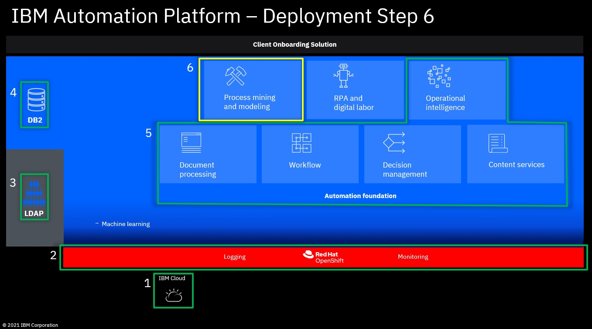

# Step 6: Optional: Install the Process Mining Operator & deploy Process Mining



1. Switch to the directory with the deployment scripts for CP4BA and DB2.

   ```
   cd /cp4ba/cp4ba-rapid-deployment/cp4ba-21-0-3/mycluster/deployment-db2-cp4ba
   ```
   
2. Make sure you have configured the following variables in `05-parametersForCp4ba.sh`:
   - `cp4baProjectname`, e.g. `ibm-cp4ba`
   - `cp4baReplicaCount`, e.g. `1`
   
3. Run script `21-deployProcessMiningOperator.sh`, it will deploy Process Mining Operator.

   Sample script output:
   
   ```
   ./21-deployProcessMiningOperator.sh 
   
   Found 05-parametersForCp4ba.sh.  Reading in variables from that script.
     Reading 05-parametersForCp4ba.sh ...
   Done!
   
   This script deploys IBM Process Mining operator. 
    
   Is 05-parametersForCp4ba.sh up to date, and do you want to continue? (Yes/No, default: No): y
   
   Preparing the Process Mining operator...
   
   Switching to project ibm-cp4ba...
   Already on project "ibm-cp4ba" on server "https://ocp.example.com".
   Preparing the subscription...
   
   Creating operator subscription...
   subscription.operators.coreos.com/processmining-subscription created
   Done.
   
   All changes got applied. Exiting...

   ```
   
4. Wait untill the Operator and all dependant Operators got installed.

5. Run script `22-deployProcessMining.sh`, it will deploy Process Mining.

   Sample script output:
   ```
   ./22-deployProcessMining.sh 
   
   Found 05-parametersForCp4ba.sh.  Reading in variables from that script.
     Reading 05-parametersForCp4ba.sh ...
   Done!
   
   This script deploys IBM Process Mining. 
    
   Is 05-parametersForCp4ba.sh up to date, and do you want to continue? (Yes/No, default: No): y
   
   Preparing the Process Mining ...
   
   Switching to project ibm-cp4ba...
   Already on project "ibm-cp4ba" on server "https://ocp.example.com".
   
   
   Deploying Process Mining...
   processmining.processmining.ibm.com/processmining created
   Done.
   
   All changes got applied. Exiting...

   ```
   
6. Verify the pods are running and ready.

   ```
   oc get pods |grep processmining
   
   c-processmining-redis-m-0                                   4/4   Running   0     68m
   c-processmining-redis-m-1                                   4/4   Running   0     68m
   c-processmining-redis-m-2                                   4/4   Running   0     68m
   c-processmining-redis-s-0                                   4/4   Running   0     66m
   c-processmining-redis-s-1                                   4/4   Running   0     66m
   c-processmining-redis-s-2                                   4/4   Running   0     66m
   processmining-analytics-79bd7d76-ggjwz                      1/1   Running   0     65m
   processmining-bpa-766d4fcdd5-fr6nv                          1/1   Running   0     65m
   processmining-connectors-5b48678b6b-8lzmj                   1/1   Running   0     65m
   processmining-dr-5d67787764-55858                           1/1   Running   0     65m
   processmining-engine-598dc7bfd7-ndmjw                       1/1   Running   0     66m
   processmining-mongo-db-98b69bf75-lf65g                      1/1   Running   0     69m
   processmining-operator-controller-manager-8df8fd6b8-6hjd6   1/1   Running   0     74m
   processmining-processmining-nginx-cb87d7f88-827ll           1/1   Running   0     68m
   processmining-processmining-um-7767c6b6c4-dmgzm             1/1   Running   0     66m
   ```
   
7. Grant users Automation Analyst role so that they can use Process Mining (if not done previously as part of Step 5).

   Open cpd route, log on with an admin user (e.g. `cp4badmin`). Click `Manage Users`, then switch to `User groups` tab, click `cp4bausers` group. Click `Roles` tab and assign `Automation Analyst` role to this group.
   
## What to do next

- If you are deploying the Client Onboarding template and want to use the **Machine Learning Service for ADS**, please complete as a next step **[Step 7: Optional: Deploy Machine Learning Service for ADS](07deployMLService4ADS.md)**
- If you want to enable the **logging infrastructure**, please complete as a next step **[Step 8: Optional: Setup OpenShift Logging Stack](08setupLogging.md)**
- If you want to enable the **monitoring infrastructure**, please complete as a next step **[Step 9: Optional: Setup OpenShift Monitoring Stack](09setupMonitoring.md)**
- Optionally, you can complete **[Step 10: Optional: Create new VM for RPA  &  install IBM RPA](10createVMForRPA.md)**
- Optionally, you can complete **[Step 11: Optional: Scale up the deployment](11scaleUp.md)**
- **[Here](Readme.md)** you can get back to the overview page

Issues or questions? IBMers can use this IBM internal Slack channel: **#dba-swat-asset-qna** (**https://ibm-cloud.slack.com/archives/C026TD1SGCA**)

Everyone else can open a new issue in this github.
